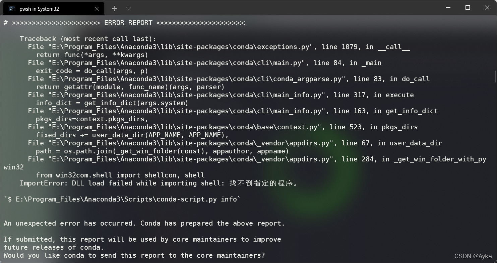
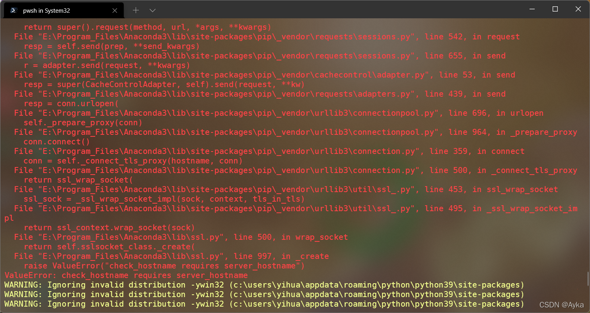
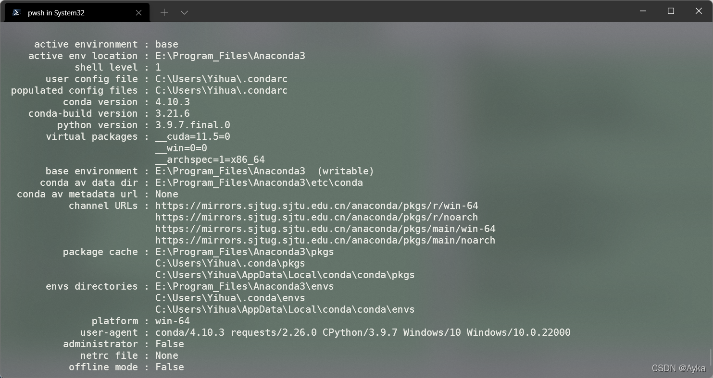

由于一些不明的错误操作导致 Anaconda 3 无法启动，显示进程已退出，在 PowerShell 里执行 conda info 报错：

> \# >>>>>>>>>>>>>>>>>>>>>> ERROR REPORT <<<<<<<<<<<<<<<<<<<<<<
>
> ​    Traceback (most recent call last):
> ​      File "E:\Program_Files\Anaconda3\lib\site-packages\conda\exceptions.py", line 1079, in \_\_call\_\_
> ​        return func(*args, **kwargs)
> ​      File "E:\Program_Files\Anaconda3\lib\site-packages\conda\cli\main.py", line 84, in \_main
> ​        exit_code = do_call(args, p)
> ​      File "E:\Program_Files\Anaconda3\lib\site-packages\conda\cli\conda_argparse.py", line 83, in do_call
> ​        return getattr(module, func_name)(args, parser)
> ​      File "E:\Program_Files\Anaconda3\lib\site-packages\conda\cli\main_info.py", line 317, in execute
> ​        info_dict = get_info_dict(args.system)
> ​      File "E:\Program_Files\Anaconda3\lib\site-packages\conda\cli\main_info.py", line 163, in get_info_dict
> ​        pkgs_dirs=context.pkgs_dirs,
> ​      File "E:\Program_Files\Anaconda3\lib\site-packages\conda\base\context.py", line 523, in pkgs_dirs
> ​        fixed_dirs += user_data_dir(APP_NAME, APP_NAME),
> ​      File "E:\Program_Files\Anaconda3\lib\site-packages\conda\_vendor\appdirs.py", line 67, in user_data_dir
> ​        path = os.path.join(_get_win_folder(const), appauthor, appname)
> ​     File "E:\Program_Files\Anaconda3\lib\site-packages\conda\_vendor\appdirs.py", line 284, in _get_win_folder_with_pywin32
> ​        from win32com.shell import shellcon, shell
> ​     ImportError: DLL load failed while importing shell: 找不到指定的程序。
>
> \`$ E:\Program_Files\Anaconda3\Scripts\conda-script.py info`
>
> An unexpected error has occurred. Conda has prepared the above report.
>
> If submitted, this report will be used by core maintainers to improve
> future releases of conda.
> Would you like conda to send this report to the core maintainers?
>
> \[y/N]: N
>
> No report sent. To permanently opt-out, use
>
>   $ conda config --set report_errors false



其它 conda 命令诸如 conda install 也失效。重装 Anaconda 和 Python 3.10 未解决该问题。我的 Anaconda 安装目录位于 E:\Program_Files\Anaconda3，于是将 E:\Program_Files\Anaconda3 添加至环境变量末尾，根据网上说法将 E:\Program_Files\Anaconda3\Library\bin 也添加至环境变量末尾，刷新环境变量后仍然错误，但系统已将 python 命令认为是 Python 3.10 的。根据网上说法执行

```powershell
E:\Program_Files\Anaconda3\Scripts\pip.exe install shell
```

提示警告：

> WARNING: Ignoring invalid distribution -ywin32 (c:\users\yihua\appdata\roaming\python\python39\site-packages)
> WARNING: Ignoring invalid distribution -ywin32 (c:\users\yihua\appdata\roaming\python\python39\site-packages)
> WARNING: Ignoring invalid distribution -ywin32 (c:\users\yihua\appdata\roaming\python\python39\site-packages)



检查提示的目录，发现该目录重装后未更新，说明 Anaconda 重装后使用了之前有问题的该目录。将该目录删除，问题解决。 


