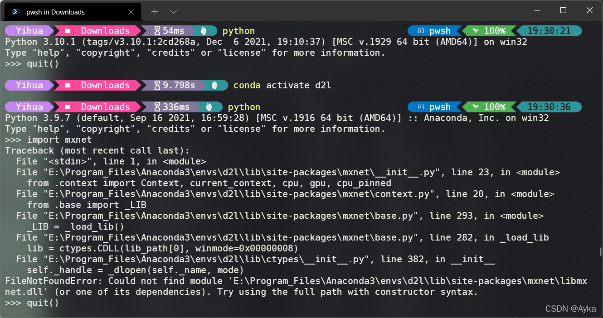

参考
Import mxnet for mxnet-cu92 fails · Issue #17887 · apache/incubator-mxnet (github.com)
https://github.com/apache/incubator-mxnet/issues/17887

libmxnet.dll unable to load with python 3.8 - win10 · Issue #18276 · apache/incubator-mxnet (github.com)
https://github.com/apache/incubator-mxnet/issues/18276
该问题可以通过将 CUDA 安装目录下的 bin 目录下的 DLL 文件复制到 mxnet 文件夹解决，对于我而言是将F:\Program Files\NVIDIA GPU Computing Toolkit\CUDA\v11.5\bin 下的文件复制到 E:\Program_Files\Anaconda3\envs\d2l\Lib\site-packages\mxnet，但是复制后该问题仍然存在，于是断定这是由于 CUDA 版本不兼容所致，本机安装的 CUDA 是 11.5 版本，而 MXNET 则是 mxnet-cu102mkl，即对应 CUDA 10.2 版本：

```powershell
pip install mxnet-cu102mkl==2.0.0b20201109 -f https://dist.mxnet.io/python
```

这种情况只能通过在虚拟环境中用 conda 或者 pip 安装指定版本的 cudatoolkit 和 cudnn 来解决：

```powershell
conda install cudatoolkit==10.2
conda install cudn
```
