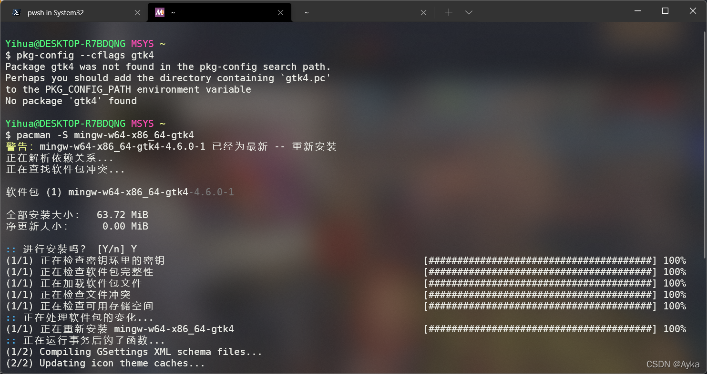
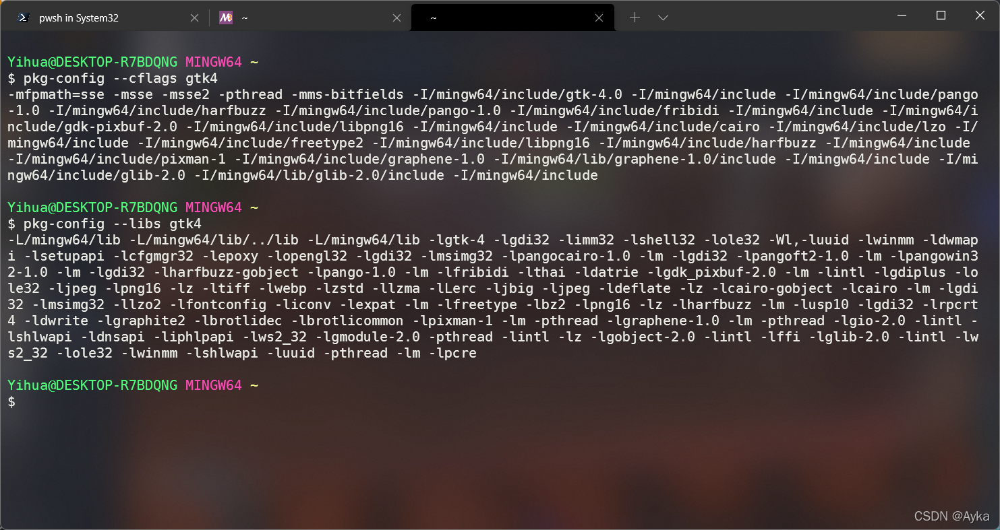
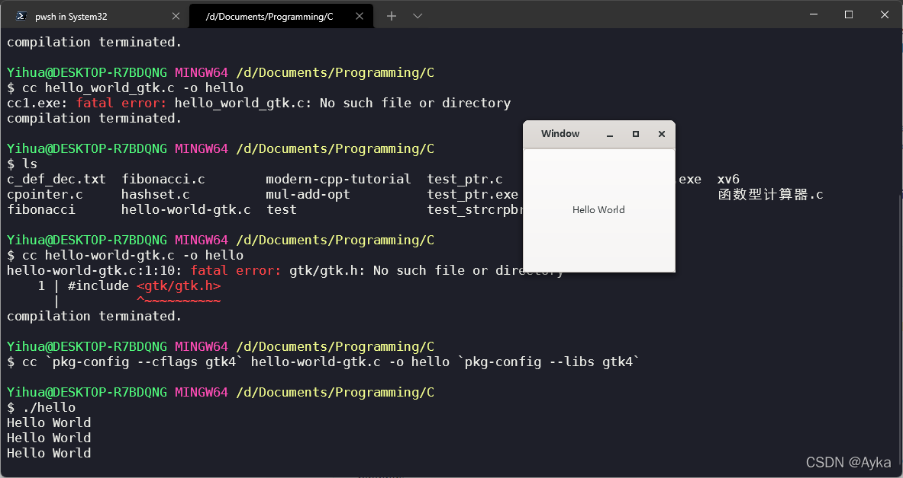

参考当前官网上的 Windows 安装 GTK 教程（[Setting up GTK for Windows](https://www.gtk.org/docs/installations/windows/)）及编译教程 [Gtk – 4.0: Compiling GTK Applications on UNIX](https://docs.gtk.org/gtk4/compiling.html)，在 MSYS2 上安装 GTK 4 并使用的方法是执行：

```bash
pacman -S mingw-w64-x86_64-gtk4
pacman -S mingw-w64-x86_64-glade
pacman -S mingw-w64-x86_64-python3-gobject
pacman -S mingw-w64-x86_64-toolchain base-devel
pkg-config --cflags gtk4
pkg-config --libs gtk4
cc `pkg-config --cflags gtk4` hello.c -o hello `pkg-config --libs gtk4`
```

在 pkg-config 时遇到错误：

> Package gtk4 was not found in the pkg-config search path.
> Perhaps you should add the directory containing `gtk4.pc'
> to the PKG_CONFIG_PATH environment variable
> No package 'gtk4' found



 原因一：

当前官网上的 Windows 安装 GTK 教程（[Setting up GTK for Windows](https://www.gtk.org/docs/installations/windows/)）过时，教程的命令为：

```bash
pacman -S mingw-w64-x86_64-gtk3
```

安装的是 GTK 3，实际上应该用以下命令安装 GTK 4：

```bash
pacman -S mingw-w64-x86_64-gtk4
```

参考：[windows - Package gtk4 was not found in the pkg-config search path - Stack Overflow](https://stackoverflow.com/questions/68150104/package-gtk4-was-not-found-in-the-pkg-config-search-path)

原因二：

经 [Msys2 in windows 10 with GTK return error pkg-config - Stack Overflow](https://stackoverflow.com/questions/64319791/msys2-in-windows-10-with-gtk-return-error-pkg-config) 提示，应在 MSYS 的 MinGW-w64 中执行 pkg-config：




