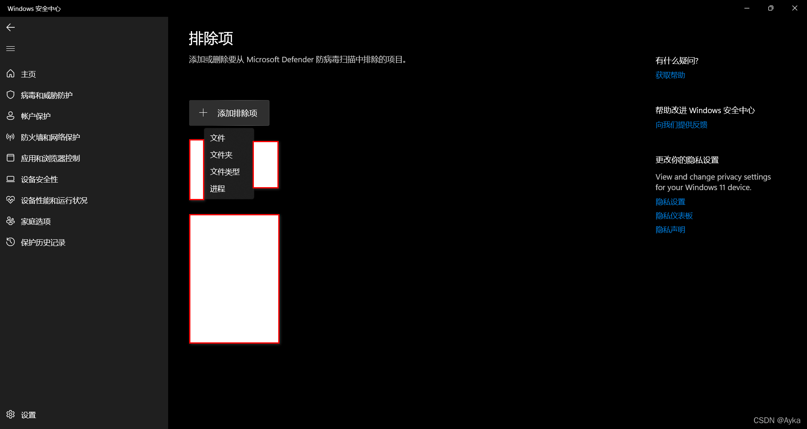

Windows 11 移动文件夹时有部分文件弹出窗口：错误 0x800700E1 无法成功完成操作。以下为解决方法（对其他操作也有效）：

设置->隐私和安全性->安全性->Windows 安全中心：

打开 Windows 安全中心->病毒和威胁防护或直接点击保护区域->病毒和威胁防护：

“病毒和威胁防护”设置->管理设置：

排除项->添加或删除排除项：

添加排除项：

将出现问题的文件或文件夹添加即可。
