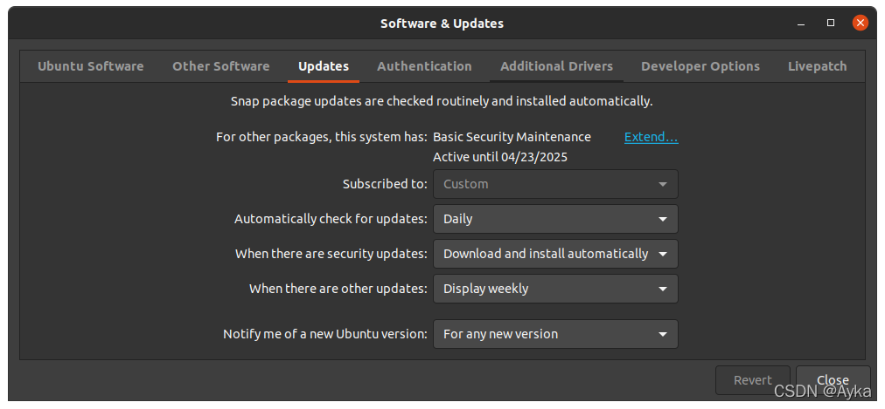
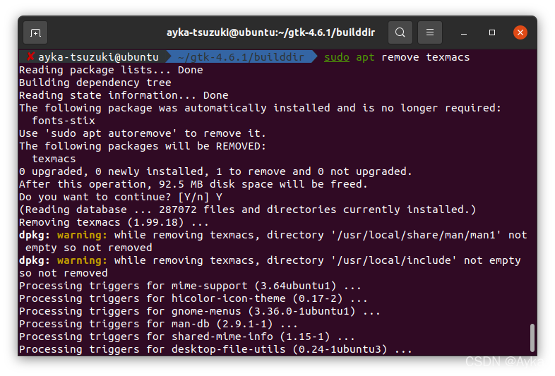

因 Ubuntu 20.04 不提供 GTK 4 的安装，所以要将 Ubuntu 20.04 升级至 21.10。

参考
服务端升级Ubuntu 20.04 LTS 记录 - 知乎 (zhihu.com)
https://zhuanlan.zhihu.com/p/136109436

首先，若要升级至非 LTS （Long Term Support）版本（例如 Ubuntu 21.10）需要将 Software & Update->Updates->Notify me of a new Ubuntu version 设置为 For any new version：



打开 Software Updater，提示检测到新版本 21.10，但是点击 Upgrade...却没反应。注意：执行

```bash
sudo apt dist-upgrade
```

只会显示

> Reading package lists... Done
> Building dependency tree       
> Reading state information... Done
> Calculating upgrade... Done
> 0 upgraded, 0 newly installed, 0 to remove and 0 not upgraded.

因为 dist-upgrade 只会检查新的 LTS 版本，如果要检查所有稳定版本应执行：

```bash
sudo do-release-upgrade
```

显示

> Checking for a new Ubuntu release
> Please install all available updates for your release before upgrading.

然而之前执行

```bash
sudo apt update
sudo apt upgrade
```

显示没有需要升级的包，反复执行依然如此。根据文章提示，执行

```bash
sudo apt list --upgradable
```

显示

> Listing... Done
> texmacs/unknown 2.1.1-1-yakkety amd64 [upgradable from: 1.99.18]
> N: There is 1 additional version. Please use the '-a' switch to see it

试图手动更新 texmacs：

```bash
sudo apt upgrade texmacs
```

产生依赖错误，于是执行

```bash
sudo apt remove texmacs
```

卸载 texmacs：



重新在 Software Updater 中检查并点击 Upgrade...更新，成功：


