借三年半以来第一次彻底重装系统的契机，时隔很久写一篇软件安装文章。SQL Server 在我看来是 Windows 系统最难安装的软件，几乎没有之一。此前的系统是通过一次非彻底的重装系统成功安装了 SQL Server 2019，然而这次在系统完全纯净的情况下却出现了经典错误之：

> 安装 SQL Server 数据库引擎服务实例功能 时出错
> 服务没有及时响应启动或控制请求。
> 错误代码: 0x80004005

英文错误名称为：The service did not respond to the start or control request in a timely fashion 

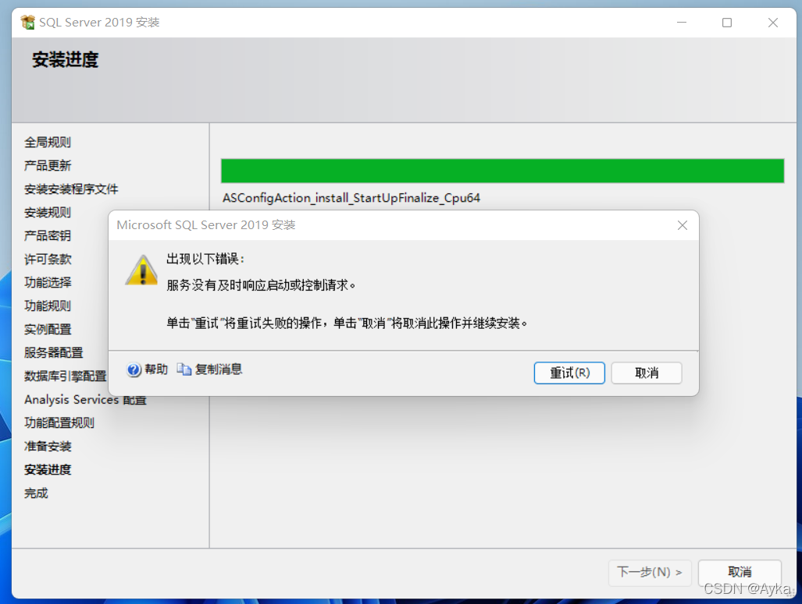

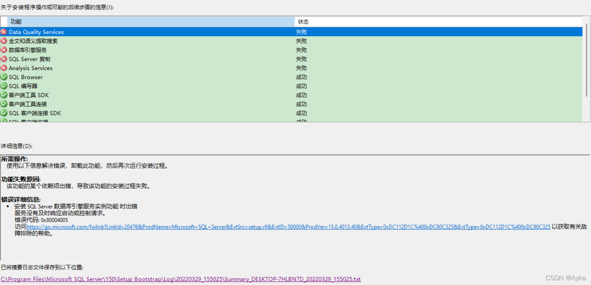

首先，对待 SQL Server 应取的只有两种方式：要么通过其安装包安装软件或组件功能，要么通过控制面板使用其标准程序卸载（或更改） SQL Server，要么重装系统；否则几乎不可能仅仅通过清理 error-free 地安装和使用 SQL Server，参考前作：

SQL Server 2014完全卸载与SQL Server 2019安装全记录_Ayka的博客-CSDN博客_彻底删除sqlserver2019
在服务中停止所有SQL Server相关服务。打开Visual Studio Installer，取消勾选SQL Server Express 2016 LocalDB、SQL ADAL运行时、SQL Server Data Tools、SQL Server ODBC Driver、SQL Server 命令行实用工具、SQL Server 支持的数据源、SQL Server 的 CLR 数据...
https://blog.csdn.net/yihuajack/article/details/105316288
第二，本文的前提也同样是【系统是清洁的】，任何会安装 SQL Server LocalDB 的其他软件（例如 Visual Studio 的主要组件）都很有可能影响 SQL Server 的安装，因此 SQL Server 的全新安装应放在这些软件之前，如果系统中有先前残留的 SQL Server（Express 或 LocalDB）的安装内容（文件、服务、注册表等），不保证本文的解决方法有效。此外，避免在 SQL Server 的安装错误未解决的情况下安装 SSMS（SQL Server Management Studio），虽然本次安装过程中未出现问题，但网上其他经验有涉及 SSMS 影响 SQL Server 成功安装的可能性。

第三，再次提示：当遇到该问题时，切勿试图以非标准方式（控制面板->卸载程序->Microsoft SQL Server 2019 (64 位)->卸载/更改(U)）进行 SQL Server 安装内容（文件、服务、注册表等）进行删除等操作，而且不要通过控制面板->卸载程序卸载或更改其他 SQL Server 相关组件（Microsoft SQL Server 2019 Setup (English)、Microsoft SQL Server 2019 T-SQL 语言服务等），而且在以标准方式卸载 SQL Server 时不要将 SQL Server 的**共享功能**（客户端工具 SDK、客户端工具连接、SQL 客户端连接 SDK 等）卸载，而应只卸载实例（的所有功能或仅仅安装失败的功能）。

第四，参考前作及本次对 [Cannot install SQL Server 2019 - Microsoft Q&A](https://docs.microsoft.com/en-us/answers/questions/201560/cannot-install-sql-server-2019.html)、[Error installing SQL Server 2019 : the service did not respond to the start or control request in a timely fashion - Microsoft Q&A](https://docs.microsoft.com/en-us/answers/questions/156723/error-installing-sql-server-2019-the-service-did-n.html) 等文章的试错，在安装失败的情况下试图通过 SQL Server 2019 配置管理器做出任何修改都是无效的，将 D:\Program Files\Microsoft SQL Server\MSSQL15.MSSQLSERVER\MSSQL\Binn\Templates 下的 master.mdf 和 mastlog.ldf 替换掉 D:\Program Files\Microsoft SQL Server\MSSQL15.MSSQLSERVER\MSSQL\DATA 中的两个对应文件也是无效的。

第五，参考 [Getting Error Installing SQL Server 2019 in Windows 11 - Stack Overflow](https://stackoverflow.com/questions/70270638/getting-error-installing-sql-server-2019-in-windows-11) 及 [SQL Server 2019: Hardware & software requirements - SQL Server | Microsoft Docs](https://docs.microsoft.com/en-us/sql/sql-server/install/hardware-and-software-requirements-for-installing-sql-server-ver15?view=sql-server-ver15#operating-system-support)，截止目前，SQL Server 2019 Enterprise 是不支持 Windows 11 的各版本的，我本次安装的正是 SQL Server 2019 Developer 版本，我的系统是 Windows 11 专业版。

第六，参考 [Cannot install Sql Server 2019 on Windows Server 2022 - Database Administrators Stack Exchange](https://dba.stackexchange.com/questions/301118/cannot-install-sql-server-2019-on-windows-server-2022/308370)，通过命令提示符执行

```
fsutil fsinfo sectorinfo C:
```

依次检查各磁盘，确认安装磁盘的 PhysicalBytesPerSectorForAtomicity 值不大于 4096。我的 SSD 磁盘该项的值均为 512。

经过多次试错，倒数第二次前做出了以下改变：

1. 在控制面板->卸载程序->启用或关闭 Windows 功能中启用 Internet Information Services 的全部功能、Internet Information Services 可承载的 Web 核心；通过 [Download Internet Information Services (IIS) 10.0 Express from Official Microsoft Download Center](https://www.microsoft.com/en-us/download/details.aspx?id=48264) 安装 IIS 10.0 Express。
2. 搜索栏搜索打开本地安全策略，安全设置->本地策略->用户权限分配->备份文件和目录->属性->本地安全设置->添加用户或组(U)...添加了当前用户；允许本地登录添加了 NT SERVICE\MSSQLFDLauncher、NT SERVICE\MSSQLSERVER、NT SERVICE\MSSQLServerOLAPService（对应的是 Analysis Services）、NT SERVICE\SQLSERVERAGENT、NT SERVICE\SQLTELEMETRY、NT SERVICE\SSASTELEMETRY（这是通过对比“作为服务登录”添加的）。第一次安装时设置 SQL Server 数据库引擎服务执行卷维护特权，第二次未设置，但“执行卷维护任务”的属性->本地安全设置中仍有 NT SERVICE\MSSQLSERVER，这启示着每一项策略中的本地安全设置即使卸载重装了 SQL Server 也不会改变。事实上，卸载后相关对象会变为“S-1-5-80”开头的名字，而重装后相关对象会恢复其本来的名字。
3. 右键 Windows 开始菜单徽标->计算机管理->本地用户和组->组->Administrators->属性或添加到组(A)...->常规->成员(M):->添加(D)...添加 NT SERVICE\MSSQLSERVER。倒数第二次试错还添加了 NT SERVICE\MSSQLServerOLAPService，确认该对象对于 Analysis Services 的成功安装是不可缺少的。
   以上三条的重要/优先程度是 3>2>1。倒数第三次试错成功安装了 Data Quality Services、全文和语义提取搜索、数据库引擎服务和 SQL Server 复制，但 Analysis Services 仍然报了相同的错误，倒数第二次试错已经成功安装全部选定实例组件。最后一次试错确认了拥有管理员权限的非 Administrators 同样可以作为 SQL Server 管理员和 Analysis Services 管理员（本机上有本地账户 Administrator 和拥有管理员权限的 Microsoft 账户），为了保险起见避免 Windows 更新等其他问题，所以最后一次安装时同时添加了两个账户作为管理员，没有错误。

总结而言，解决该错误的具体操作方法是：

1. 当安装程序至少进行到第二次错误窗口弹出时（即本文的第一张截图处），就可以看到本地安全策略中“作为服务登录”策略已经添加了 SQL Server 相关对象（卸载 SQL Server 后是无法添加的）。此时就可以在本地安全策略中的“允许本地登录”策略和组->Administrators 中添加 SQL Server 相关对象。添加的具体方式是：进入用户权限分配页面，找到“允许本地登录”：
   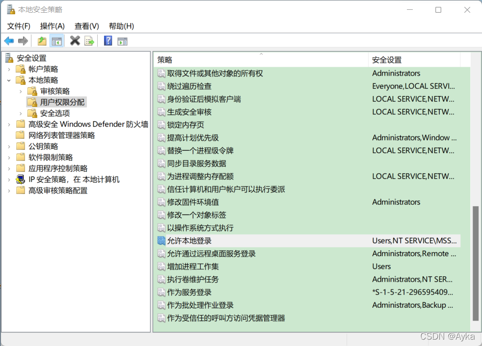

   参考“作为服务登录”的本地安全设置（倒数第三次试错前)：
   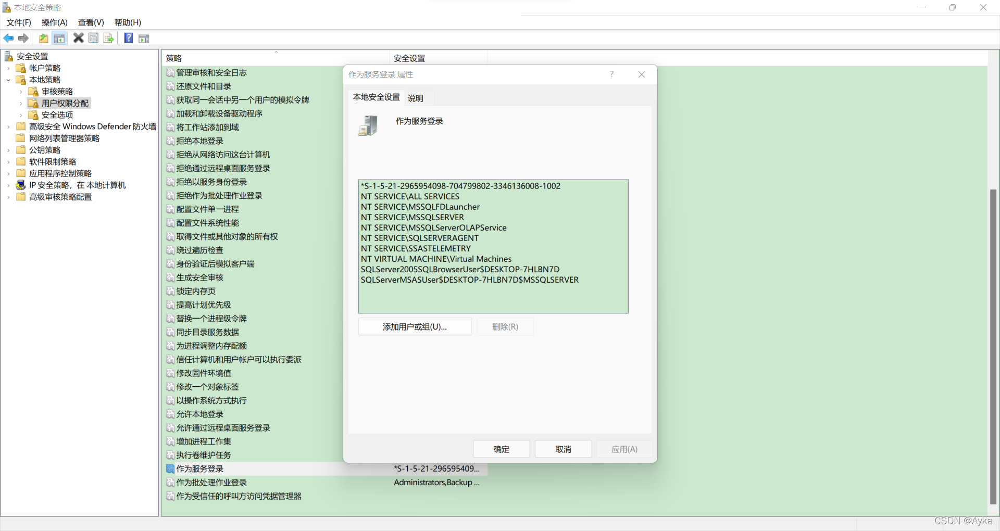

   或（倒数第三次试错时)：
   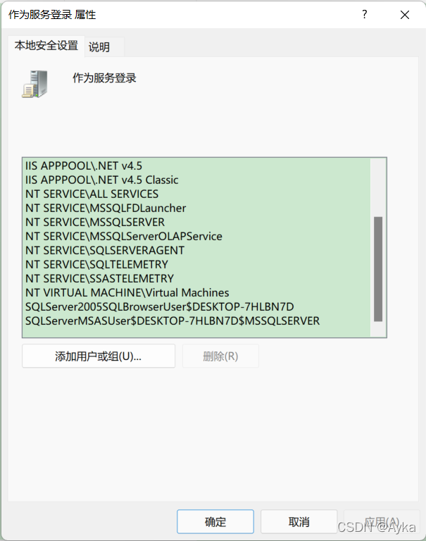

   将“允许本地登录”的本地安全设置更改为：
   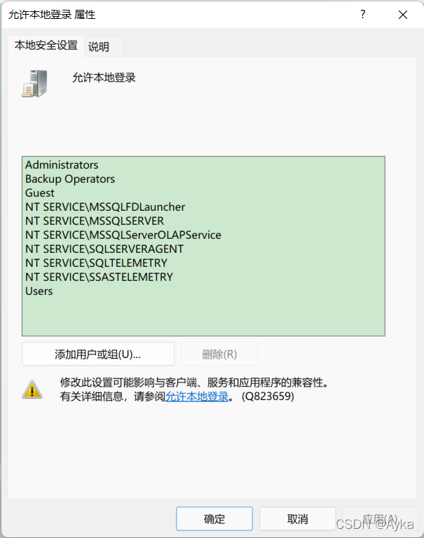

   ”添加用户或组(U)...弹出窗口，输入对象名称来选择(示例)(E):，以 NT SERVICE\MSSQLSERVER 为例，输入 NT Service\MSSQLServer（大小写不敏感），然后点击“检查名称(C)”：
   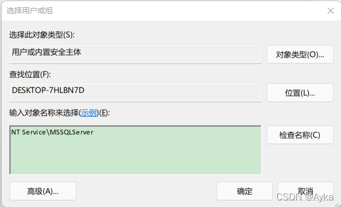

   如果只有一个名称匹配对象，则文本框中直接变成带下划线的名称，直接确定即可；如果有多个名称匹配对象，选择匹配名称确定，再确定即可：
   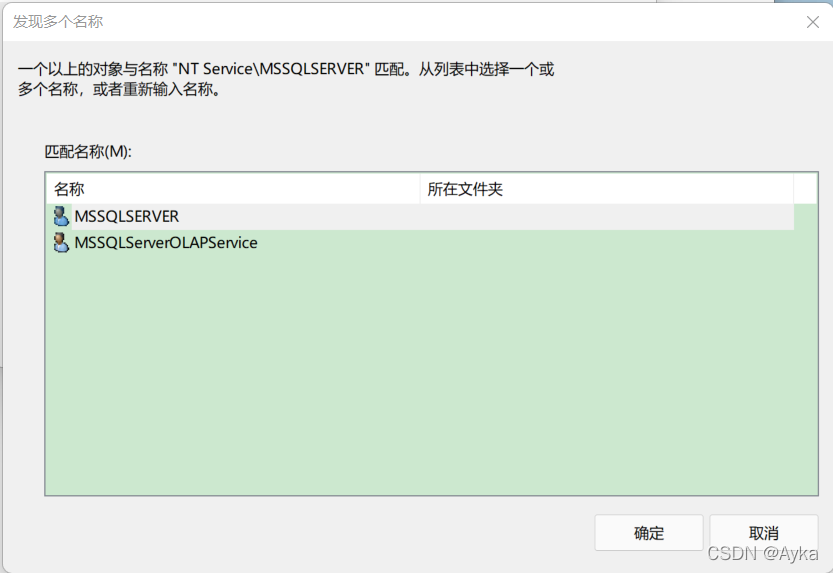

2. 以同样的方式修改组->Administrators 成员添加如下：
   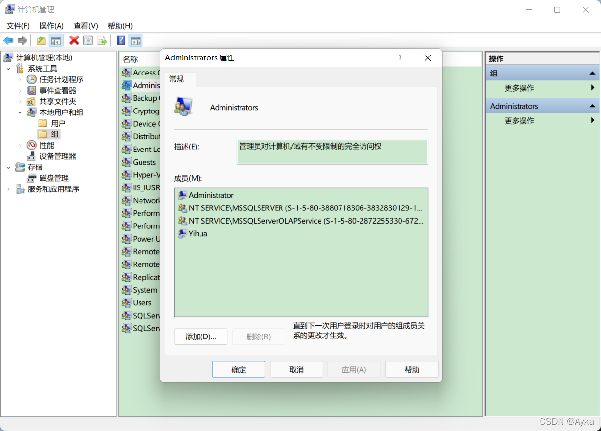

3. 添加后**重启计算机**，然后卸载 SQL Server 的 MSSQLSERVER 实例。

4. 卸载后**重启计算机**，然后重新启动 SQL Server 安装程序，在功能选择页面可以看到之前安装失败的实例功能是可选的（没有变灰，如果不卸载直接启动安装程序选项会变成灰色无法选定，而先前安装成功的共享功能的选项的灰色锁定的）：
   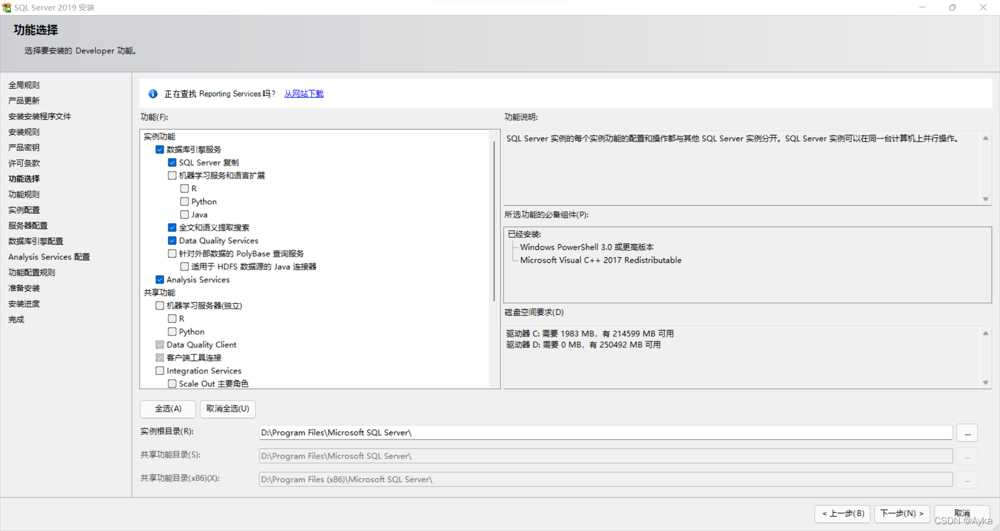

   虽然安装程序和卸载程序并不要求重启计算机，但是相关计算机管理设置都是需要重启才能生效的，这一点通过试错确认。

5. 服务器配置页面务必保持默认设置，不要试图更改账户名：
   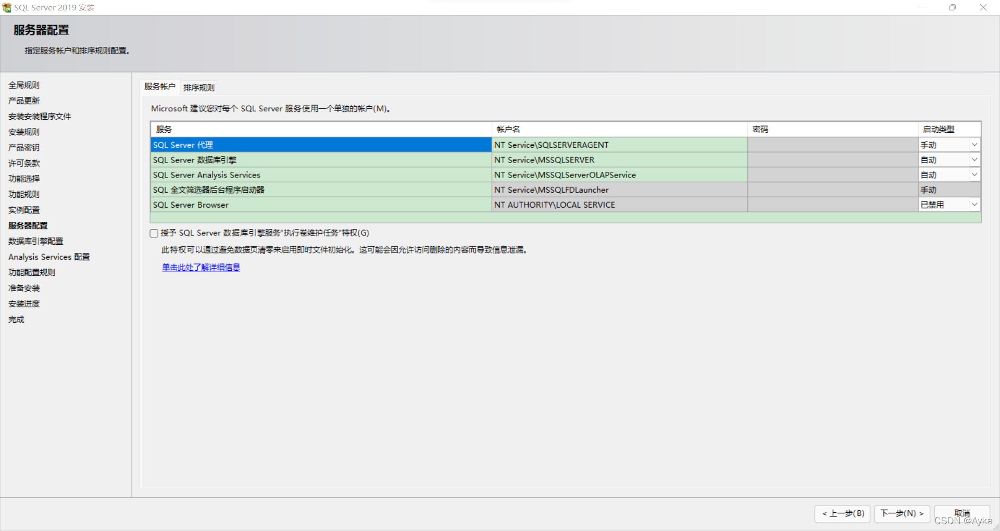

   在随后的数据库引擎配置页面的服务器配置->身份验证模式使用 Windows 身份验证模式( W) 即可。指定 SQL Server 管理员可以同时添加 Administrator 账户和其他拥有管理员权限的账户，Analysis Services 配置->服务器配置同样如此：
   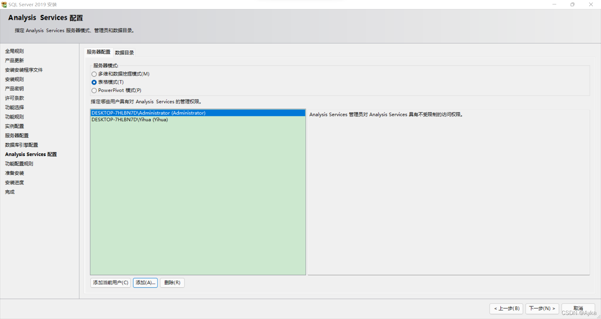

6. 其他设置保持默认，继续安装过程，即可成功安装。
