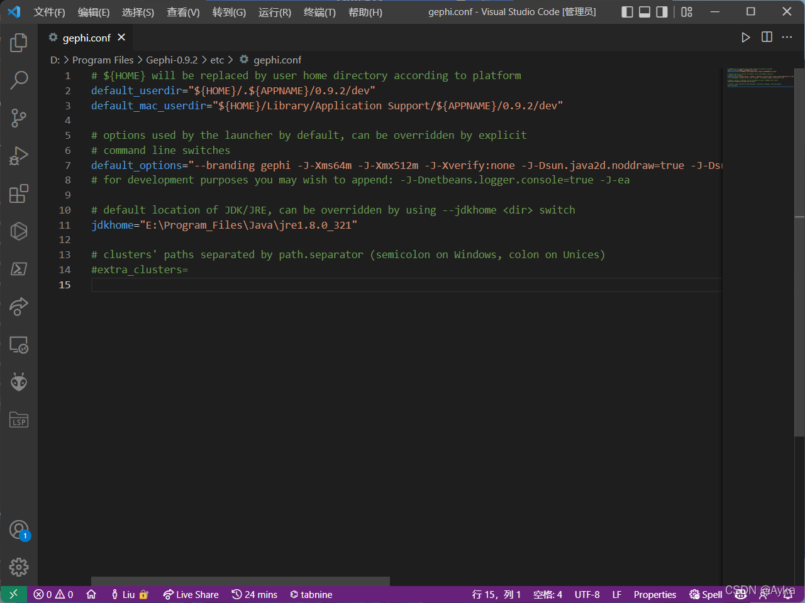

安装好 Gephi 后启动，起初报错是 cannot find Java 1.8 or higher，参考
java - How to solve Gephi error : cannot load even default layout (Installation step) - Stack Overflow
https://stackoverflow.com/questions/67528809/how-to-solve-gephi-error-cannot-load-even-default-layout-installation-step

更改 gephi.conf 的 jdkhome 为 JDK 路径后又报错：Cannot load even default layout, using internally predefined。该问题的确是由 JDK 的问题导致的，但是我们无需按照 [2021-10-21_就问你难不难受0_o的博客-CSDN博客](https://blog.csdn.net/chujunwen/article/details/120884171) 的做法降级 JDK，而是只需要到 Java 的官网下载最新版 JRE：https://www.java.com/zh-CN/download/。然后，将 gedit.conf 中的 jdkhome 路径改为 JRE 的路径：

即可启动成功。
