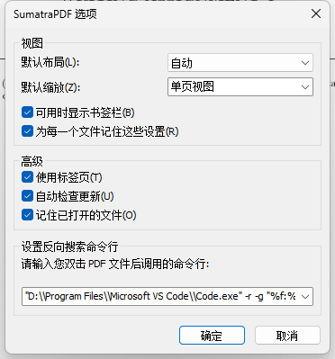
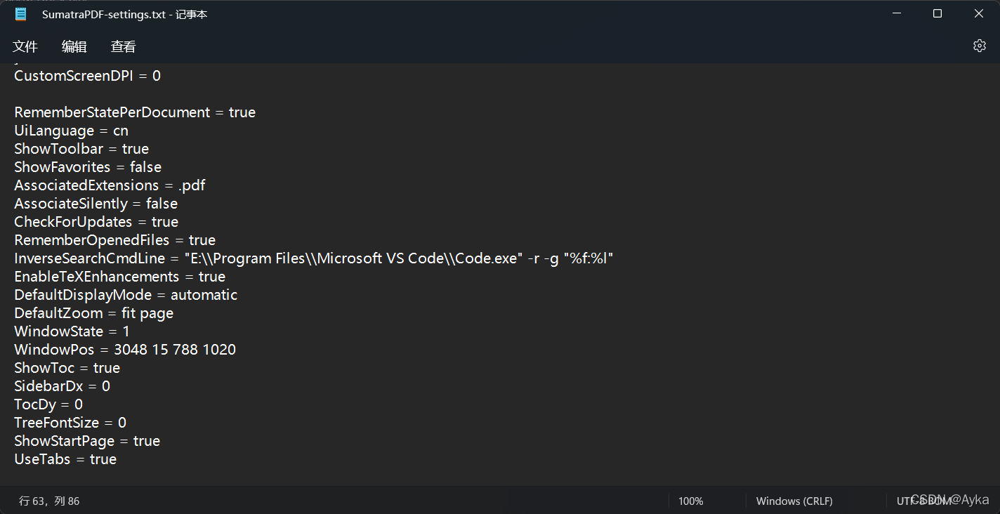

本文配置最初参考 [【LaTeX】如何愉快地肝report —— VS Code × LaTeX____JIM___的博客-CSDN博客](https://blog.csdn.net/weixin_44009599/article/details/102842498)，这也是笔者多年来一直使用并改进的配置，但原博文已不更新，而 SumatraPDF 更新后多次导致原文配置早已失效，故本文将持续更新 LaTeX 配置。

TeX Live 的安装很简单，在 [Index of /systems/texlive/Images/ (globo.tech)](https://ctan.mirror.globo.tech/systems/texlive/Images/) 下载 ISO 镜像文件后安装即可，默认会添加系统环境变量，若未添加可手动添加系统环境变量指向 Tex Live 安装目录（我的是 D:\texlive\2021\bin\win32），在此不表。

VS Code 配置 LaTeX 的核心扩展为 LaTeX Workshop，所有配置都由它负责。其它可选扩展例如 LaTeX language support 和 LaTeX Snippets，相比于扩展提供的 Snippets，我更鼓励在 VS Code 的左下角齿轮->->用户代码片段->latex.json (LaTeX) 中自定义一些 Snippets，效率远高于扩展提供的通用 Snippets，定义的方式在 JSON 文件开头的注释里已经给出了，并给出了例子：

> Place your snippets for latex here. Each snippet is defined under a snippet name and has a prefix, body and description. The prefix is what is used to trigger the snippet and the body will be expanded and inserted. Possible variables are:
>
> \$1, \$2 for tab stops, \$0 for the final cursor position, and \${1:label}, ${2:another} for placeholders. Placeholders with the same ids are connected.
>
> Example:
>
> "Print to console": {
>     "prefix": "log",
>     "body": [
>         "console.log('$1');",
>         "$2"
>     ],
>     "description": "Log output to console"
> }

我在这里也给一个例子：

```json
"Figure:LYH": {
    "prefix": "fig",
	"body": [
		"\\begin{figure}[H]",
		"\t\\centering",
		"\t\\includegraphics[width=$1\\textwidth]{$2}",
		"\t\\caption{$3}",
		"\\end{figure}"
	],
	"description": "Figure in Ayka's style"
}
```


安装 SumatraPDF 和 VS Code，然后在 VS Code 中安装 LaTeX Workshop 扩展，完成后，在 VS Code 的左下角齿轮->设置->右上角从右至左第 3 个图标即“打开设置 (json)”打开 settings.json，添加：

```latex
{
    "latex-workshop.latex.tools": [
        {
            "name": "pdflatex",
            "command": "pdflatex",
            "args": [
                "-shell-escape",
                "-synctex=1",
                "-interaction=nonstopmode",
                "-file-line-error",
                "%DOC%"
            ]
        },
        {
            "name": "xelatex",
            "command": "xelatex",
            "args": [
                "-shell-escape",
                "-synctex=1",
                "-interaction=nonstopmode",
                "-file-line-error",
                "%DOC%"
            ]
        },
        {
            "name": "lualatex",
            "command": "lualatex",
            "args": [
                "-shell-escape",
                "-synctex=1",
                "-interaction=nonstopmode",
                "-file-line-error",
                "%DOC%"
            ]
        },
        {
            "name": "bibtex",
            "command": "bibtex",
            "args": [
                "%DOCFILE%"
            ]
        }
    ],
    "latex-workshop.latex.recipes": [
        {
            "name": "PDFLaTeX",
            "tools": [
                "pdflatex"
            ]
        },
        {
            "name": "XeLaTeX",
            "tools": [
                "xelatex"
            ]
        },
        {
            "name": "LuaLaTeX",
            "tools": [
                "lualatex"
            ]
        },
        {
            "name": "latexmk",
            "tools": [
                "latexmk"
            ]
        },
        {
            "name": "BibTeX",
            "tools": [
                "bibtex"
            ]
        },
        {
            "name": "pdflatex -> bibtex -> pdflatex*2",
            "tools": [
                "pdflatex",
                "bibtex",
                "pdflatex",
                "pdflatex"
            ]
        },
        {
            "name": "xelatex -> bibtex -> xelatex*2",
            "tools": [
                "xelatex",
                "bibtex",
                "xelatex",
                "xelatex"
            ]
        }
    ],
    "latex-workshop.view.pdf.viewer": "external",
    "latex-workshop.view.pdf.external.viewer.command": "E:\\Program Files\\SumatraPDF\\SumatraPDF.exe",
    "latex-workshop.view.pdf.external.synctex.command": "E:\\Program Files\\SumatraPDF\\SumatraPDF.exe",
    "latex-workshop.view.pdf.external.synctex.args": [
        "-forward-search",
        "%TEX%",
        "%LINE%",
        "-reuse-instance",
        "-inverse-search",
        "\"E:\\Program Files\\Microsoft VS Code\\Code.exe\" -r -g \"%f:%l\"",
        "%PDF%"
    ]
}
```

复制粘贴上述配置后请注意合并最外层的大括号，并将 SumatraPDF 和 VS Code 的路径改为自己的安装路径。

LuaLaTeX 对 TikZ 等包至关重要，建议配置；"pdflatex -> bibtex -> pdflatex*2" 和 "xelatex -> bibtex -> xelatex*2" 两个 Recipe 是用来编译使用 BibLaTeX 的 LaTeX 文档的，编译 BibLaTeX 需要完整的编译链，即 PDFLaTeX 或 XeLaTeX 编译一遍，BibTeX 编译一遍，PDFLaTeX 或 XeLaTeX 再编译两遍，这就是这两个 Recipe 的由来。这样配置后 VS Code 只要按下 Ctrl+S 保存键就会自动使用 PDFLaTeX 的 Recipe 进行项目生成；“-shell-escape”参数对应的是 \write18 TeX 命令，对很多包的编译都至关重要，如果这样配置后你的 LaTeX 在编译过程中仍然报了与 -shell-escape 或 \write18 的错误，请仔细查找到底是什么其他地方产生了错误，不必怀疑自己是不是配置得有问题了。

上述配置同时已经指定了 VS Code LaTeX 默认使用外部的 PDF 查看器为 SumatraPDF，并且为 SumatraPDF 的反向搜索做好了准备。接下来只需打开 SumatraPDF，左上角三道杠->设置(S)->选项(O)...打开“SumatraPDF选项”窗口，并在“设置反向搜索命令行”一栏的文本框中输入

>"D:\\Program Files\\Microsoft VS Code\\Code.exe" -r -g "%f:%l



也可以左上角三道杠->设置(S)->高级选项(A)...打开 SumatraPDF-settings.txt，参考
Customizing SumatraPDF 3.2 (sumatrapdfreader.org)
https://www.sumatrapdfreader.org/settings/settings

虽然该文件末尾写着：

> \# Settings after this line have not been recognized by the current version

但对应上述文档可发现在“RememberOpenedFiles = true”和“EnableTeXEnhancements = true”中漏了一条可设置的选项

> pattern used to launch the LaTeX editor when doing inverse search
> InverseSearchCmdLine =

于是在上述两行中间插入（见下图）：

InverseSearchCmdLine = "E:\\Program Files\\Microsoft VS Code\\Code.exe" -r -g "%f:%l"

注意：该项的值同时就是 latex-workshop.view.pdf.external.synctex.args 中的第 6 条参数，只不过 VS Code 的设置中要将该值加双引号，所以里面的双引号都加了反斜杠转义。同样记得将 VS Code 的路径改为你自己的安装路径，保存该记事本文件，然后反向搜索就即时成功启用了。



## 更新日志 ChangeLog

### 2023 年 7 月 1 日

SumatraPDF 更新至 3.4.6 版本后在其左上角三道杠->设置(S)->选项(O)...中重新加入了“设置反向搜索命令行”，故本文重新加入了该简便方法。

### 2022 年 3 月 31 日

SumatraPDF 更新至 3.3.3 版本后在其左上角三道杠->设置(S)->选项(O)...中取消了“设置反向搜索命令行”，故改为在高级选项中手动添加该设置。

### 2020 年 11 月 29 日

添加 LuaLaTeX 支持。

### 2020 年 10 月 7 日

根据 [LaTeX Workshop Issue #637](https://github.com/James-Yu/LaTeX-Workshop/issues/637)，将 InverseSearchCmdLine 和 "latex-workshop.view.pdf.external.synctex.args" 添加 -r 参数。
