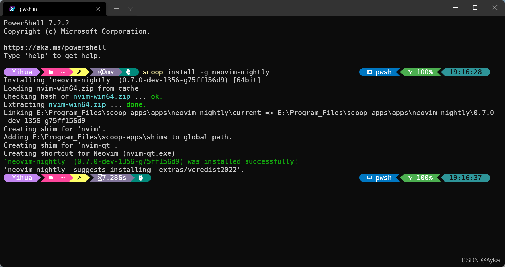

Winget：

参考
windows - How to specify winget installation folder - Super User
https://superuser.com/questions/1688575/how-to-specify-winget-installation-folder

Windows 11 系统已经自带了 winget；winget 安装的包的位置通过 -l 选项指定，例如：

```powershell
winget install JanDeDobbeleer.OhMyPosh -l "E:\Program_Files\winget\OhMyPosh"
```

Scoop：

参考
Quick Start | Scoop (scoop-docs.vercel.app)
https://scoop-docs.vercel.app/docs/getting-started/Quick-Start.html#installing-scoop

在 PowerShell 中执行

```powershell
$env:SCOOP='E:\Program_Files\scoop'
[Environment]::SetEnvironmentVariable('SCOOP',$env:SCOOP,'User')
$env:SCOOP_GLOBAL='E:\Program_Files\scoop-apps'
[Environment]::SetEnvironmentVariable('SCOOP_GLOBAL',$env:SCOOP_GLOBAL,'Machine')
Invoke-Expression (New-Object System.Net.WebClient).DownloadString('https://get.scoop.sh')
```

前两行设置 scoop 本身的安装位置，3~4 行设置 scoop 安装的包的位置，最后一行安装 scoop。

注意：所指定的路径必须存在，若不存在应手动创建，然后以管理员身份运行 PowerShell。例如，执行

```powershell
scoop install -g neovim-nightly
```

显示

> Installing 'neovim-nightly' (0.7.0-dev-1356-g75ff156d9) [64bit]
> Loading nvim-win64.zip from cache
> Checking hash of nvim-win64.zip ... ok.
> Extracting nvim-win64.zip ... done.
> Linking E:\Program_Files\scoop-apps\apps\neovim-nightly\current => E:\Program_Files\scoop-apps\apps\neovim-nightly\0.7.0-dev-1356-g75ff156d9
> Creating shim for 'nvim'.
> Adding E:\Program_Files\scoop-apps\shims to global path.
> Creating shim for 'nvim-qt'.
> Creating shortcut for Neovim (nvim-qt.exe)
> 'neovim-nightly' (0.7.0-dev-1356-g75ff156d9) was installed successfully!
> 'neovim-nightly' suggests installing 'extras/vcredist2022'.

成功安装在指定位置：



Chocolatey：

首先，从很久以前开始，Chocolatey Pro 版本和 Chocolatey Business (C4B) 版本就可以任意指定安装位置，这一功能参考
Chocolatey Software Docs | Ubiquitous Install Directory Option (Pro+)
https://docs.chocolatey.org/en-us/features/install-directory-override

添加的选项为：

>     ​     --dir, --directory, --installdir, --installdirectory, --install-dir, --install-directory=VALUE
  ​     Install Directory Override - Override the default installation director-
  ​       y. Chocolatey will automatically determine the type of installer and 
  ​       pass the appropriate arguments to override the install directory. The 
  ​       package must use Chocolatey install helpers and be installing an 
  ​       installer for software. Available in 0.9.10+. [Licensed editions](https://chocolatey.org/compare) only. 
  ​       See https://docs.chocolatey.org/en-us/features/install-directory-override 

对于 Chocolatey Free 版本，参考
Chocolatey Software Docs | Setup / Install
https://docs.chocolatey.org/en-us/choco/setup#installing-to-a-different-location

安装前在 PowerShell 中执行

```powershell
$env:ChocolateyInstall='E:\Program_Files\Chocolatey'
[Environment]::SetEnvironmentVariable('ChocolateyInstall',$env:ChocolateyInstall,'Machine')
Set-ExecutionPolicy Bypass -Scope Process -Force; [System.Net.ServicePointManager]::SecurityProtocol = [System.Net.ServicePointManager]::SecurityProtocol -bor 3072; iex ((New-Object System.Net.WebClient).DownloadString('https://community.chocolatey.org/install.ps1'))
```

前两句指定 Chocolatey 本身的安装位置，最后一行安装 Chocolatey。若不指定，则 Chocolatey 的默认安装位置是 %PROGRAMDATA%\Chocolate（即 %SystemDrive%\ProgramData\Chocolatey，自 0.9.8.24 版本起）。不建议指定为 C:\Chocolatey，这是旧版的默认安装位置。在安装前应手动创建安装路径文件夹（若不存在）。安装完成后若有相关提示，应执行

```powershell
notepad $PROFILE
```

使用记事本打开 C:\Users\<username>\Yihua\Documents\PowerShell\Microsoft.PowerShell_profile.ps1 （若不存在则需手动创建文件夹和文件），添加

```powershell
$ChocolateyProfile = "$env:ChocolateyInstall\helpers\chocolateyProfile.psm1"
if (Test-Path($ChocolateyProfile)) {
  Import-Module "$ChocolateyProfile"
}
```

然后执行

```powershell
. $PROFILE
```

刷新 PowerShell 配置即可。在安装了 Chocolatey 后可以使用

```powershell
refreshenv
```

命令刷新当前 session/会话 的环境变量。此后在设置->系统->关于->高级系统设置->环境变量中可以看到 ChocolateyInstall 环境变量已经被添加为系统变量。

Chocolatey 安装的包的位置在 $ChocolateyInstall\lib，也就是说之前手动设置了 ChocolateyInstall 环境变量后 Chocolatey 安装的包的位置同样会改变，例如执行

```powershell
choco install chocolateygui
```

后可以看到 ChocolateyGUI 被安装到 E:\Program_Files\Chocolatey\lib 下（chocolateygui.exe 和 chocolateyguicli.exe 在 E:\Program_Files\Chocolatey\bin 下）。然而，参考

Chocolatey Software Docs | Getting Started
https://docs.chocolatey.org/en-us/getting-started#:~:text=Chocolatey%20packages%20are%20installed%20to,are%20based%20on%20Windows%20installers%20(.
Chocolatey Software Docs | Getting Started
https://docs.chocolatey.org/en-us/getting-started#overriding-default-install-directory-or-other-advanced-install-concepts
以及
Chocolatey Software Docs | FAQs
https://docs.chocolatey.org/en-us/faqs#why-doesnt-a-package-install-software-to-program-files
有些包是基于 Windows Installer 的 MSI 文件的（例如 ruby 和 neovim），会被安装到 Program Files 下，可以通过手动指定 MSI 安装选项 -ia "INSTALLDIR=""D:\Program Files"""（CMD）来指定安装位置，参考 [Chocolatey Software Docs | Install](https://docs.chocolatey.org/en-us/choco/commands/install#installarguments) 给出的安装选项

>      ​     --ia, --installargs, --install-args, --installarguments, --install-arguments=VALUE
  ​     InstallArguments - Install Arguments to pass to the native installer in 
  ​       the package. Defaults to unspecified.

NSIS 安装包也可以，例如安装 Notepad++：

```powershell
choco install notepadplusplus.install -ia "'/D=E:\SomeDirectory\somebody\npp'"
```

还有的则会被安装到 $env:ChocolateyBinRoot 下，这一环境变量若为手动指定则默认为 C:\tools。例如，Neovim 就将被安装到 C:\tools\neovim。执行

```powershell
$env:ChocolateyBinRoot='E:\Program_Files\Chocolatey-apps'
[Environment]::SetEnvironmentVariable('ChocolateyBinRoot',$env:ChocolateyBinRoot,'Machine'
$env:ChocolateyToolsRoot='E:\Program_Files\Chocolatey-apps'
[Environment]::SetEnvironmentVariable('ChocolateyToolsRoot',$env:ChocolateyToolsRoot,'Machine')
choco install neovim --pre
```


前四行添加环境变量（根据文档，\$ChocolateyToolsRoot 环境变量将取代 $ChocolateyBinRoot 环境变量），最后一行安装包。注意：所指定的路径同样必须已存在，若尚未存在需提前手动创建。但是将上述两个环境变量都设置好后，有些包仍然是安装在 C:\tools 下的，偶然间发现环境变量中的用户变量有一个变量名为 ChocolateyToolsLocation，其值为 C:\tools，将其值改为自己想指定的目录即可。
