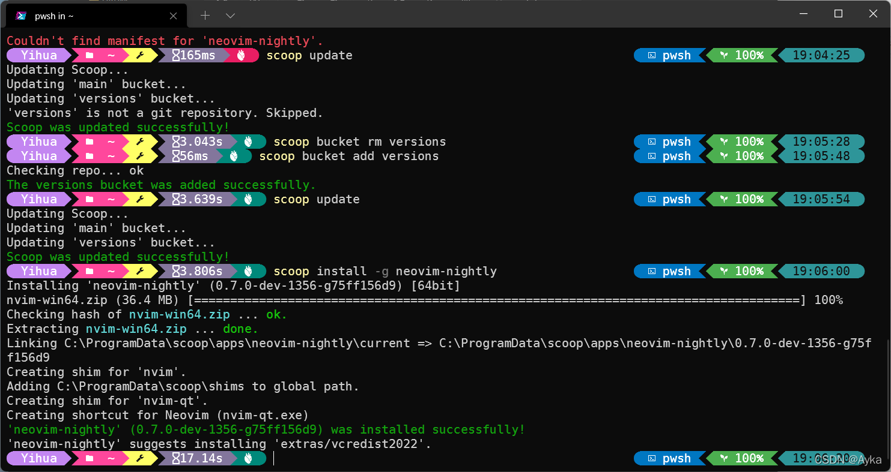

试图安装 neovim-nightly，在 [scoop 包列表](https://sedlar.me/scoop-frontend/)中中检查，其 bucket 为 versions，于是执行

```powershell
scoop bucket add versions
```

添加该 bucket，重新安装，仍然显示

> Couldn't find manifest for 'neovim-nightly'.

这时，执行

```powershell
scoop update
```

更新 scoop，显示：

> Updating Scoop...
> Updating 'main' bucket...
> Updating 'versions' bucket...
> 'versions' is not a git repository. Skipped.
> Scoop was updated successfully!

注意到了问题：versions 疑似在添加时损坏或不完整。执行

```powershell
scoop bucket rm versions
scoop bucket add versions
scoop update
```

重新添加该 bucket 并更新，显示

> Checking repo... ok
> The versions bucket was added successfully.
>
> Updating Scoop...
> Updating 'main' bucket...
> Updating 'versions' bucket...
> Scoop was updated successfully!

这时再执行

```powershell
scoop install -g neovim-nightly
```

安装成功：

> Installing 'neovim-nightly' (0.7.0-dev-1356-g75ff156d9) [64bit]
> nvim-win64.zip (36.4 MB) [\=\=\=\=\=\=\=\=\=\=\=\=\=\=\=\=\=\=\=\=\=\=\=\=\=\=\=\=\=\=\=\=\=\=\=\=\=\=\=\=\=\=\=\=\=\=\=\=\=\=\=\=\=\=\=\=\=\=\=\=\=\=\=\=\=\=\=\=\=\=\=\=\=\=\=\=\=\=\=\=\=\=\=\=] 100%
> Checking hash of nvim-win64.zip ... ok.
> Extracting nvim-win64.zip ... done.
> Linking C:\ProgramData\scoop\apps\neovim-nightly\current => C:\ProgramData\scoop\apps\neovim-nightly\0.7.0-dev-1356-g75ff156d9
> Creating shim for 'nvim'.
> Adding C:\ProgramData\scoop\shims to global path.
> Creating shim for 'nvim-qt'.
> Creating shortcut for Neovim (nvim-qt.exe)
> 'neovim-nightly' (0.7.0-dev-1356-g75ff156d9) was installed successfully!
> 'neovim-nightly' suggests installing 'extras/vcredist2022'.



该问题是 scoop 的不完善导致，scoop 在添加 bucket 或安装包时，即使没有合适的网络环境导致连接到 GitHub 等网站下载失败，也会显示添加或安装成功，但实则没有安装成功。第一次添加 bucket 失败就是由于尚未正确配置网络的缘故，配置好网络后重新添加即可解决问题。
