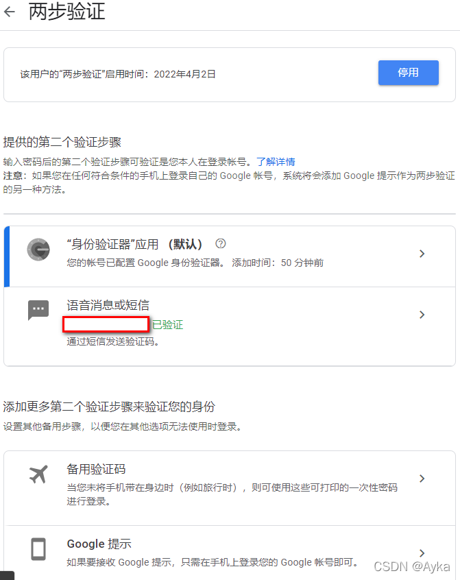
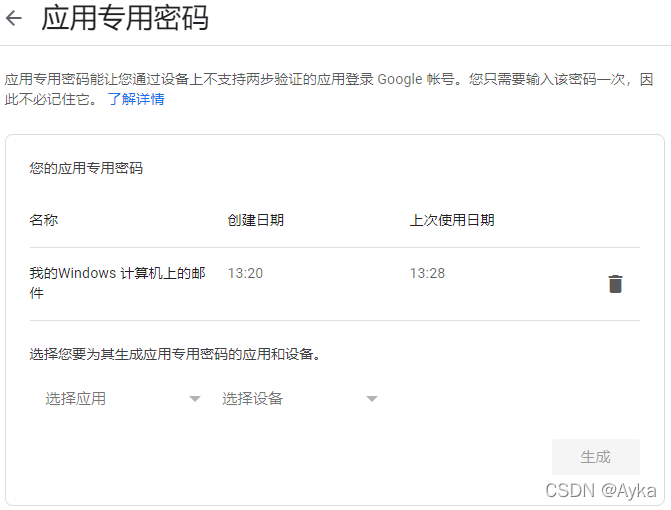
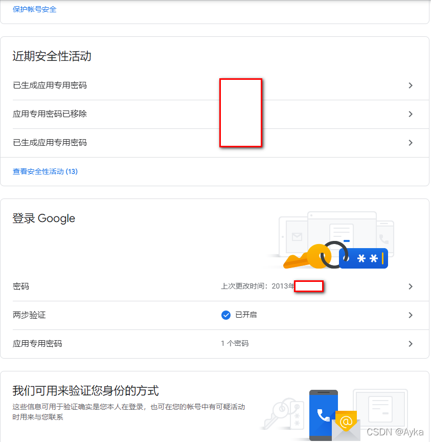
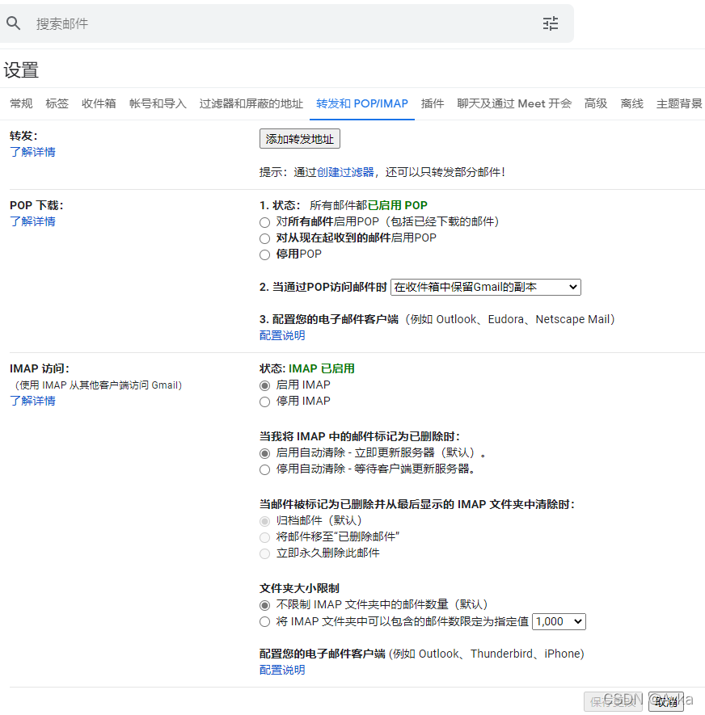
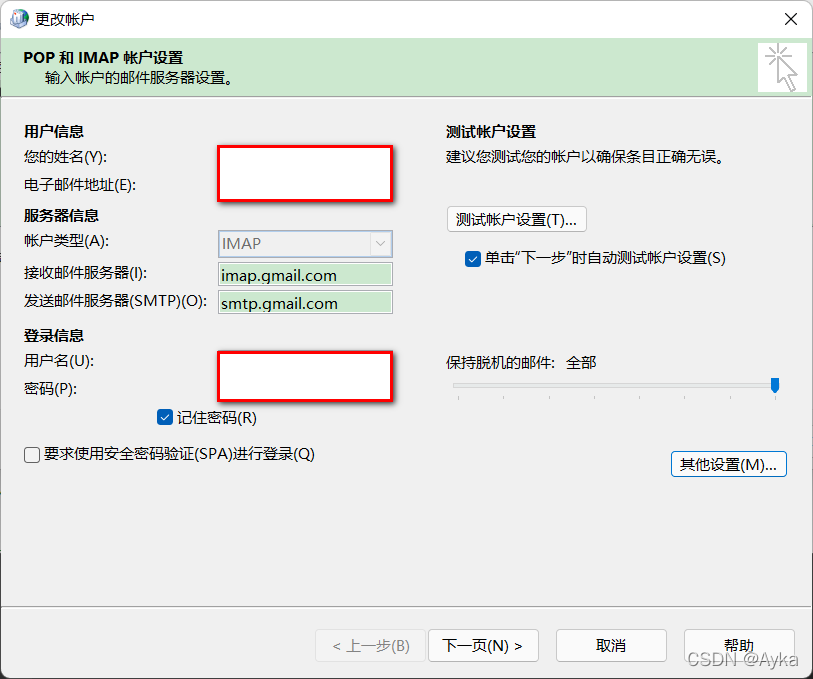
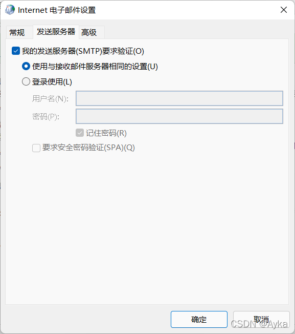
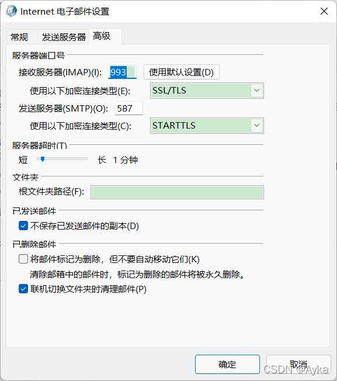
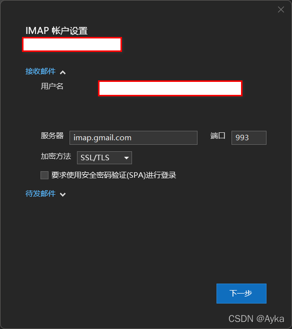
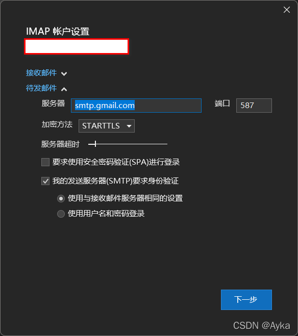
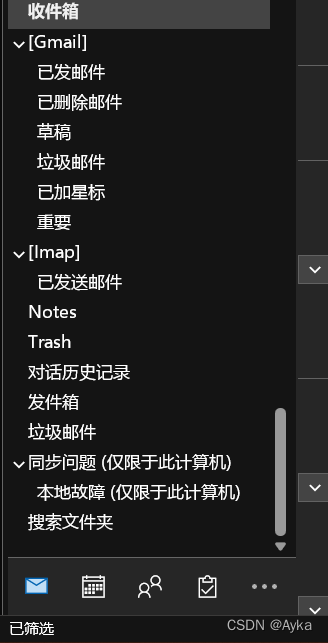

本文适用于 Windows 11 Microsoft Outlook 365。参考了 [为何用outlook设置Gmail无法通过验证？ - 知乎](https://www.zhihu.com/question/39679287/answer/985345036)、https://support.google.com/mail/answer/7104828、[通过其他电子邮件平台查看 Gmail - Gmail帮助 (google.com)](https://support.google.com/mail/answer/7126229)、[Add a Gmail account to Outlook (microsoft.com)](https://support.microsoft.com/en-us/office/add-a-gmail-account-to-outlook-70191667-9c52-4581-990e-e30318c2c081)。

1. 参考[将 Gmail 帐户添加到 Outlook (microsoft.com)](https://support.microsoft.com/zh-cn/office/将-gmail-帐户添加到-outlook-70191667-9c52-4581-990e-e30318c2c081?ui=zh-cn&rs=zh-cn&ad=cn)，打开 Google 账号设置->安全性：https://myaccount.google.com/u/0/security->“登录 Google”下启用“两步验证”，默认验证步骤为“语音消息或短信”，建议在“添加更多第二个验证步骤来验证您的身份”使用“身份验证器”应用（Authenticator）作为第二个验证步骤：
   
2. 同样在“登录 Google”下启用“应用专用密码”，“选择您要为其生成应用专用密码的应用和设备”选择应用为“邮件”，选择设备为“Windows 计算机”，生成：
   
   
3. Gmail 右上角齿轮->快捷设置->查看所有设置，设置->转发和 POP/IMAP：
   
4. 关闭 Outlook 程序。控制面板->所有控制面板项->Mail (Microsoft Outlook) 打开“邮件设置 -- Outlook”窗口，电子邮件账户->电子邮件账户(E)...打开“账户设置”窗口，电子邮件->新建(N)...打开“添加账户”窗口，选择电子邮件账户(A) 填入您的姓名(Y)、电子邮件地址(E)、密码(P) 和重新键入密码(T)，这里密码要填写之前设置的应用专用密码。直接连接即可。如果第一次不行，确认 POP 和 IMAP 账户设置，填入用户信息，服务器信息->账户类型(A) 为 IMAP，接收邮件服务器(I) 为 imap.gmail.com，发送邮件服务器(SMTP)(O) 设置为 smtp.gmail.com，填入登录信息，这里的密码同样为之前设置的应用专用密码，无需“要求使用安全密码验证(SPA)进行登录(Q)”：
   
   其他设置(M)...打开“Internet 电子邮件设置”窗口，发送服务器勾选“我的发送服务器(SMTP)要求验证(O)”，并选择“使用与接受邮件服务器相同的设置(U)”：
   
   高级->服务器端口号->接收服务器(IMAP)(I) 设置为 993，使用以下加密连接类型(E) 为 SSL/TLS，发送服务器(SMTP)(O) 设置为 587，使用以下加密连接类型(C) 为 STARTTLS：
   
5. 启用全局 proxy，并在相关应用中的高级设置中勾选“允许其他设备连接本机……”。
6. 重新打开 Microsoft Outlook，可以看到 Gmail 邮箱已被添加，并开始自动同步文件夹。在文件->信息->账户设置->服务器设置(S) 中确认：
   
   

配置成功：

