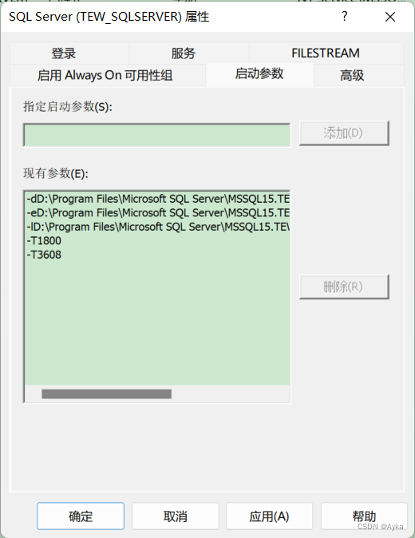

SQL Server 启动报错：

查看事件查看器（本地）->自定义视图->管理事件：

5 条错误信息分别为：

FCB::Open failed: 无法打开文件号 1 的文件 d:\dbs\sh\s19s\0924_133725\cmd\2\obj\x64retail\sql\mkmastr\databases\mkmastr.proj\MSDBData.mdf。操作系统错误: 3(系统找不到指定的路径。)。

FileMgr::StartLogFiles: 创建或打开文件 'd:\dbs\sh\s19s\0924_133725\cmd\2\obj\x64retail\sql\mkmastr\databases\mkmastr.proj\MSDBLog.ldf' 时出现操作系统错误 2(系统找不到指定的文件。)。请诊断并更正该操作系统错误，然后重试操作。

FCB::Open failed: 无法打开文件号 1 的文件 d:\dbs\sh\s19s\0924_133725\cmd\2\obj\x64retail\sql\mkmastr\databases\mkmastr.proj\model.mdf。操作系统错误: 3(系统找不到指定的路径。)。

FileMgr::StartLogFiles: 创建或打开文件 'd:\dbs\sh\s19s\0924_133725\cmd\2\obj\x64retail\sql\mkmastr\databases\mkmastr.proj\modellog.ldf' 时出现操作系统错误 2(系统找不到指定的文件。)。请诊断并更正该操作系统错误，然后重试操作。

SQL Server (TEW_SQLSERVER) 服务由于下列服务特定错误而终止: 
%%945

参考：[SQl server is unable to start in a timely fashion. The error log says that it is unable to find the locations to some files on "d:" drive. The funny part is that I only have a single partition disk "C:" - Microsoft Q&A](https://docs.microsoft.com/en-us/answers/questions/663579/sql-server-is-unable-to-start-in-a-timely-fashion.html)

和 [Misaligned log IOs which required falling back to synchronous IO (mssqltips.com)](https://www.mssqltips.com/sqlservertip/5942/sql-server-misaligned-log-ios-which-required-falling-back-to-synchronous-io/)

打开 Sql Server Configuration Manager，SQL Server 配置管理器（本地）->SQL Server 服务，找到报错的服务 SQL Server (TEW_SQLSERVER)，右键->属性(R) 打开属性窗口，打开“启动参数”选项卡，指定启动参数(S):，键入 -T1800 点击“添加(D)”，键入 -T3608 点击“添加(D)”：

确定后重新启动该服务即可成功。
