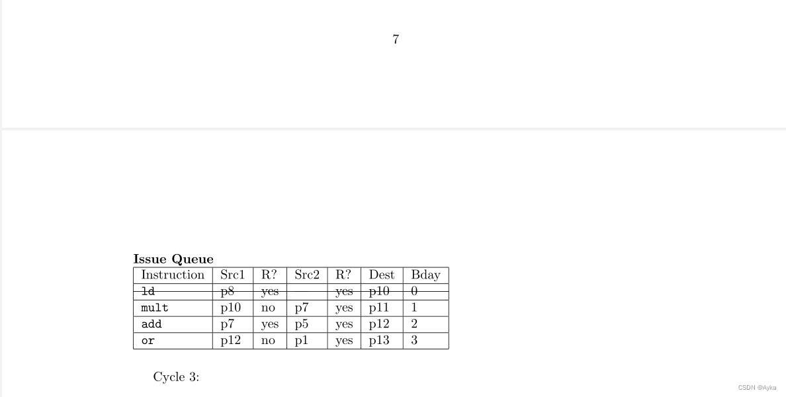

本方法旨在画出一条贯穿表格左右两端的横线，如果要画出一条从表格左端文字起始到右端文字结束的横线，请参考

text decorations - Make whole line of a table stroke through - TeX - LaTeX Stack Exchange
https://tex.stackexchange.com/questions/265727/make-whole-line-of-a-table-stroke-through
Draw a horizonal line over the entries of a row in an array - TeX - LaTeX Stack Exchange
https://tex.stackexchange.com/questions/79741/draw-a-horizonal-line-over-the-entries-of-a-row-in-an-array
tables - Striking thru a tabular row in LaTeX - TeX - LaTeX Stack Exchange
https://tex.stackexchange.com/questions/276738/striking-thru-a-tabular-row-in-latex/276804#276804
而

tables - Striking thru a tabular row in LaTeX - TeX - LaTeX Stack Exchange
https://tex.stackexchange.com/questions/276738/striking-thru-a-tabular-row-in-latex/276758#276758
的方法会多添加竖线，不够完美。

本文的方法参考

strike out an entire line in table - TeX - LaTeX Stack Exchange
https://tex.stackexchange.com/questions/350150/strike-out-an-entire-line-in-table
但该方法中纵向距离不适合默认表格的行宽，经过微调试验，得到默认表格行宽对应的命令如下：

MWE：

```latex
\begin{table}[H]
    \textbf{Issue Queue}\\
    \begin{tabular}{|l|l|l|l|l|l|l|}
        \hline
        Instruction&Src1&R?&Src2&R?&Dest&Bday\\
        \hline
        \texttt{ld}&p8&yes&---&yes&p10&0\\[-1.5ex]\hline\noalign{\vspace{\dimexpr 1.87ex-\doublerulesep}}
        \hline
        \texttt{mult}&p10&no&p7&yes&p11&1\\
        \hline
        \texttt{add}&p7&yes&p5&yes&p12&2\\
        \hline
        \texttt{or}&p12&no&p1&yes&p13&3\\
        \hline
    \end{tabular}
\end{table}
```

实现效果如下：


