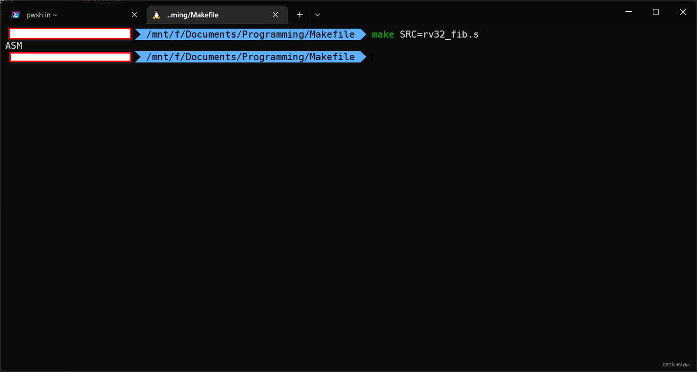

参考
Get filename without extension within makefile - Stack Overflow
https://stackoverflow.com/questions/13995906/get-filename-without-extension-within-makefile
与
GNU make 8.3 Functions for File Names
https://www.gnu.org/software/make/manual/make.html#File-Name-Functions
最小样例如下：

```makefile
SRCNAME = $(basename bar_1.foo.c)
SRCTYPE = $(suffix bar_1.foo.c)
```

其结果为 SRCNAME 是 bar_1.foo，SRCTYPE 是 .c（注意这里的后缀名是包含句点的）。

实用样例如下：

```makefile
SRCNAME = $(basename $(SRC))
SRCTYPE = $(suffix $(SRC))
all:
ifeq ($(SRCTYPE),.s)
all: assembly
else ifeq ($(SRCTYPE),.c)
all: program
else
	$(error Source file suffix must be *.c or *.s)
endif

assembly:
	@echo ASM
program:
	@echo C
```

注意这里的第二个和第三个 all target 不可添加缩进， 参考[conditional - How do you conditionally call a target based on a target variable (Makefile)? - Stack Overflow](https://stackoverflow.com/questions/19105241/how-do-you-conditionally-call-a-target-based-on-a-target-variable-makefile)

注意 ifeq 条件的逗号前后不可添加空格，结尾只添加一个 endif。

例如若在命令行中执行

```bash
make SRC=rv32_fib.s
```

则会输出

> ASM


