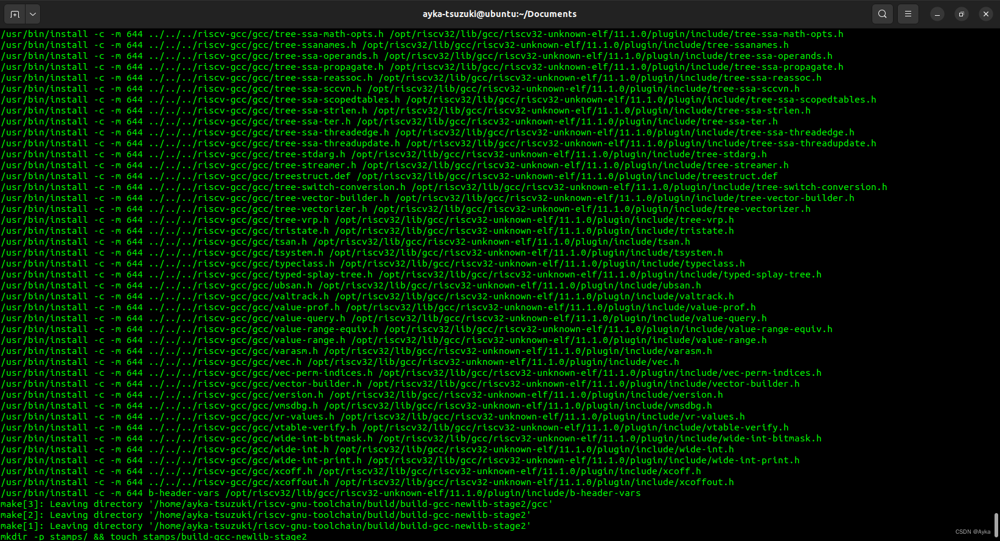

在 git clone https://github.com/riscv-collab/riscv-gnu-toolchain 后执行

```bash
cd riscv-gnu-toolchain
mkdir build && cd build
../configure --prefix=/opt/riscv32 --with-arch=rv32imc
sudo make -j8
```

后报错：

> fatal: unsafe repository is owned by someone else

即使根据提示执行了

```bash
git config --global --add safe.directory /home/ayka-tsuzuki/riscv-gnu-toolchain
```

添加 safe.directory 并执行

```bash
git config --list
```

确认已添加后仍然无效。执行

```bash
sudo chown -R ayka-tsuzuki .
```

更改文件夹所属用户也无效。最后删除克隆的仓库，使用

```bash
git clone https://github.com/riscv/riscv-gnu-toolchain --recursive
```

命令（添加 --recursive 参数）重新克隆后，再次执行之前的命令 make，成功：



