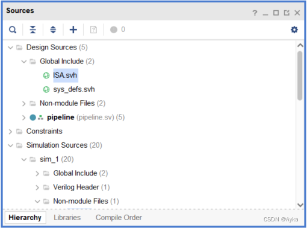

Xilinx Vivado does not support setting the file type of a file as SystemVerilog Header till now (version 2021.2.1). This article assumes using "Vivado" Syntax Checking for Xilinx Vivado Text Editor.

Import *.svh files to Design Sources, where their hierarchy layer is "Non-module Files". In "Sources" sub-window, right-click the .svh files，and click "Set Global Include". After that, *.svh files are appeared in "Global Include" hierarchy layer：



The default file type of these *.svh files is "Verilog Header", so if these *.svh files contain syntaxes that are not Verilog-only, then the syntax checking of Vivado Text Editor will show syntax errors. However, if you set their file type as "SystemVerilog", then the syntax checking will throw no errors for design sources, but throw syntax errors for simulation sources still. Nevertheless, they can both do successful simulations. Obviously, it is a bug of Vivado's syntax checking. If you really do not like the wrong buggy syntax checking, you can try switching file types and doing simulations, then the bug may disappear.

If you add

```systemverilog
`include "sys_defs.svh"
```

at the beginning of the simulation sources and the file type of these *.svh files is "Verilog Header", the syntax checking will throw the warning "Warning: cannot open include file 'sys_defs.svh' ", and syntax errors same as the case without the include statement. If the file type of these *.svh files is "SystemVerilog", then the syntax errors are the same as the case that the file type of these *.svh files is "Verilog Header", but the simulation will fail:

> ERROR: [VRFC 10-3195] cannot open include file 'sys_defs.svh' [F:/Documents/GitHub/ECE4700J_SU2022/Lab4/project-v-open-beta-For-ECE4700J/optimization/testbench/mem.sv:1]
> INFO: [VRFC 10-311] analyzing module mem
> ERROR: [VRFC 10-2865] module 'mem' ignored due to previous errors [F:/Documents/GitHub/ECE4700J_SU2022/Lab4/project-v-open-beta-For-ECE4700J/optimization/testbench/mem.sv:18]

and

> ERROR: [USF-XSim-62] 'compile' step failed with error(s). Please check the Tcl console output or 'F:/Documents/GitHub/ECE4700J_SU2022/Lab4/lab_4/lab_4.sim/sim_1/behav/xsim/xvlog.log' file for more information.
> ERROR: [Vivado 12-4473] Detected error while running simulation. Please correct the issue and retry this operation.
> launch_simulation: Time (s): cpu = 00:00:01 ; elapsed = 00:00:07 . Memory (MB): peak = 1551.020 ; gain = 0.000
> ERROR: [Common 17-39] 'launch_simulation' failed due to earlier errors. 

so do not do that. In brief, do not use any "include" statements. 
