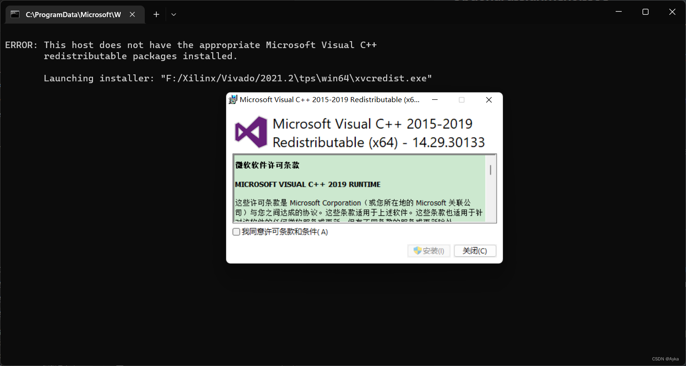
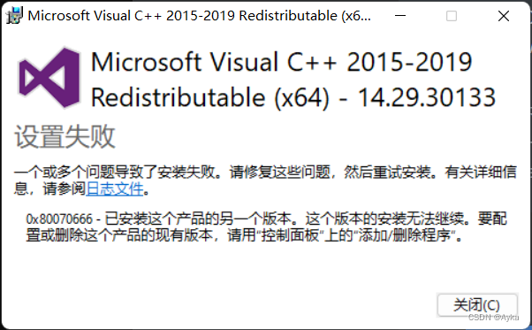
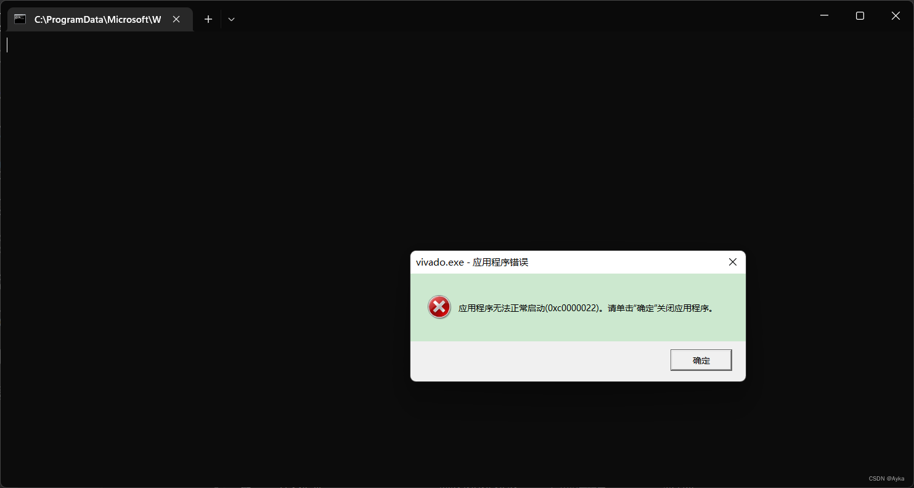
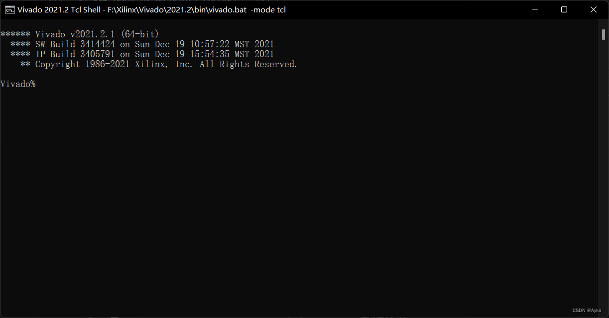

In Windows 11, start Vivado 2021.2 Tcl Shell:



> ERROR: This host does not have the appropriate Microsoft Visual C++
>           redistributable packages installed.
     
     ​       Launching installer: "F:/Xilinx/Vivado/2021.2\tps\win64\xvcredist.exe"

It will launch the installer, but the installation will fail with error code 0x80070666 because I have already installed another version of this product:



The contents of the log file are:

> \[5C60:1AA4][2022-06-27T15:59:31]i001: Burn v3.10.4.4718, Windows v10.0 (Build 22000: Service Pack 0), path: C:\Users\Yihua\AppData\Local\Temp\{0B5F199F-F6F9-432B-ABB6-1D3367BCC360}\.cr\vcredist_x64.exe
> \[5C60:1AA4][2022-06-27T15:59:31]i009: Command Line: '-burn.clean.room=f:\xilinx\vivado\2021.2\tps\win64\vcredist_x64.exe -burn.filehandle.attached=604 -burn.filehandle.self=752'
> \[5C60:1AA4][2022-06-27T15:59:31]i000: Setting string variable 'WixBundleOriginalSource' to value 'f:\xilinx\vivado\2021.2\tps\win64\vcredist_x64.exe'
> \[5C60:1AA4][2022-06-27T15:59:31]i000: Setting string variable 'WixBundleOriginalSourceFolder' to value 'f:\xilinx\vivado\2021.2\tps\win64\'
> \[5C60:1AA4][2022-06-27T15:59:31]i000: Setting string variable 'WixBundleLog' to value 'C:\Users\Yihua\AppData\Local\Temp\dd_vcredist_amd64_20220627155931.log'
> \[5C60:1AA4][2022-06-27T15:59:31]i000: Setting string variable 'WixBundleName' to value 'Microsoft Visual C++ 2015-2019 Redistributable (x64) - 14.29.30133'
> \[5C60:1AA4][2022-06-27T15:59:31]i000: Setting string variable 'WixBundleManufacturer' to value 'Microsoft Corporation'
> \[5C60:443C][2022-06-27T15:59:31]i000: Setting version variable 'WixBundleFileVersion' to value '14.29.30133.0'
> \[5C60:1AA4][2022-06-27T15:59:31]i100: Detect begin, 11 packages
> \[5C60:1AA4][2022-06-27T15:59:31]i000: Setting string variable 'Arm64_Check' to value 'AMD64'
> \[5C60:1AA4][2022-06-27T15:59:31]i000: Setting version variable 'windows_uCRT_DetectKey' to value '10.0.22000.1'
> \[5C60:1AA4][2022-06-27T15:59:31]i000: Setting numeric variable 'windows_uCRT_DetectKeyExists' to value 1
> \[5C60:1AA4][2022-06-27T15:59:31]i102: Detected related bundle: {2d507699-404c-4c8b-a54a-38e352f32cdd}, type: Upgrade, scope: PerMachine, version: 14.32.31326.0, operation: Downgrade
> \[5C60:1AA4][2022-06-27T15:59:31]i052: Condition '(VersionNT = v6.3 AND NOT VersionNT64) AND (windows_uCRT_DetectKeyExists AND windows_uCRT_DetectKey >= v10.0.10240.0)' evaluates to false.
> \[5C60:1AA4][2022-06-27T15:59:31]i052: Condition '(VersionNT = v6.3 AND VersionNT64) AND (windows_uCRT_DetectKeyExists AND windows_uCRT_DetectKey >= v10.0.10240.0)' evaluates to false.
> \[5C60:1AA4][2022-06-27T15:59:31]i052: Condition '(VersionNT = v6.2 AND NOT VersionNT64) AND (windows_uCRT_DetectKeyExists AND windows_uCRT_DetectKey >= v10.0.10240.0)' evaluates to false.
> \[5C60:1AA4][2022-06-27T15:59:31]i052: Condition '(VersionNT = v6.2 AND VersionNT64) AND (windows_uCRT_DetectKeyExists AND windows_uCRT_DetectKey >= v10.0.10240.0)' evaluates to false.
> \[5C60:1AA4][2022-06-27T15:59:31]i052: Condition '(VersionNT = v6.1 AND NOT VersionNT64) AND (windows_uCRT_DetectKeyExists AND windows_uCRT_DetectKey >= v10.0.10240.0)' evaluates to false.
> \[5C60:1AA4][2022-06-27T15:59:31]i052: Condition '(VersionNT = v6.1 AND VersionNT64) AND (windows_uCRT_DetectKeyExists AND windows_uCRT_DetectKey >= v10.0.10240.0)' evaluates to false.
> \[5C60:1AA4][2022-06-27T15:59:31]i052: Condition '(VersionNT = v6.0 AND NOT VersionNT64) AND (windows_uCRT_DetectKeyExists AND windows_uCRT_DetectKey >= v10.0.10240.0)' evaluates to false.
> \[5C60:1AA4][2022-06-27T15:59:31]i052: Condition '(VersionNT = v6.0 AND VersionNT64) AND (windows_uCRT_DetectKeyExists AND windows_uCRT_DetectKey >= v10.0.10240.0)' evaluates to false.
> \[5C60:1AA4][2022-06-27T15:59:31]i103: Detected related package: {C96241EA-9900-4FE8-85B3-1E238D509DF6}, scope: PerMachine, version: 14.32.31326.0, language: 0 operation: Downgrade
> \[5C60:1AA4][2022-06-27T15:59:31]i103: Detected related package: {38624EB5-356D-4B08-8357-C33D89A5C0C5}, scope: PerMachine, version: 14.32.31326.0, language: 0 operation: Downgrade
> \[5C60:1AA4][2022-06-27T15:59:31]i101: Detected package: Windows81_x86, state: Absent, cached: None
> \[5C60:1AA4][2022-06-27T15:59:31]i101: Detected package: Windows81_x64, state: Absent, cached: None
> \[5C60:1AA4][2022-06-27T15:59:31]i101: Detected package: Windows8_x86, state: Absent, cached: None
> \[5C60:1AA4][2022-06-27T15:59:31]i101: Detected package: Windows8_x64, state: Absent, cached: None
> \[5C60:1AA4][2022-06-27T15:59:31]i101: Detected package: Windows7_MSU_x86, state: Absent, cached: None
> \[5C60:1AA4][2022-06-27T15:59:31]i101: Detected package: Windows7_MSU_x64, state: Absent, cached: None
> \[5C60:1AA4][2022-06-27T15:59:31]i101: Detected package: WindowsVista_MSU_x86, state: Absent, cached: None
> \[5C60:1AA4][2022-06-27T15:59:31]i101: Detected package: WindowsVista_MSU_x64, state: Absent, cached: None
> \[5C60:1AA4][2022-06-27T15:59:31]i101: Detected package: vcRuntimeMinimum_x64, state: Obsolete, cached: None
> \[5C60:1AA4][2022-06-27T15:59:31]i101: Detected package: vcRuntimeAdditional_x64, state: Obsolete, cached: None
> \[5C60:1AA4][2022-06-27T15:59:31]i101: Detected package: vcRuntime_arm64, state: Absent, cached: None
> \[5C60:1AA4][2022-06-27T15:59:31]i052: Condition 'VersionNT64 >= v6.0 OR (VersionNT64 = v5.2 AND ServicePackLevel >= 1)' evaluates to true.
> \[5C60:1AA4][2022-06-27T15:59:31]i199: Detect complete, result: 0x0
> \[5C60:443C][2022-06-27T16:02:17]i000: Setting numeric variable 'EulaAcceptCheckbox' to value 1
> \[5C60:443C][2022-06-27T16:02:17]e000: Error 0x80070666: Cannot install a product when a newer version is installed.

I have installed Microsoft Visual Studio 2022 on my computer, so I have installed Microsoft Visual C++ 2015-2022 Redistributable (x86) and Microsoft Visual C++ 2015-2022 Redistributable (x64) before. Look into F:\Xilinx\Vivado\2021.2\bin\loader.bat, I found

```
set XVREDIST=%RDI_APPROOT%\tps\%RDI_PLATFORM%\xvcredist.exe
if not [%XIL_PA_NO_REDIST_CHECK%] == [1] (
  if exist "%XVREDIST%" (
    "%XVREDIST%" -check
    if [!ERRORLEVEL!] == [1] (
      echo.
      echo ERROR: This host does not have the appropriate Microsoft Visual C++
      echo        redistributable packages installed.
      echo.
      if not [%RDI_BATCH_MODE%] == [True] (
        echo        Launching installer: "%XVREDIST%"
	"%XVREDIST%"
        if not [!ERRORLEVEL!] == [0] (
	  pause
          set RDI_EXIT=True
          goto :EOF
        )
      ) else (
        echo        To install the required packages run:
        echo        "%XVREDIST%"
        set RDI_EXIT=True
        goto :EOF
      )
    )
  )
)
```

So I tried to delete F:\Xilinx\Vivado\2021.2\tps\win64\xvcredist.exe and re-launch Vivado 2021.2 Tcl Shell, but it shows 0xc0000022:



At this time we know what the problem is. Undo the deletion, run Vivado 2021.2 Tcl Shell as Administrator:



The problem is solved.
