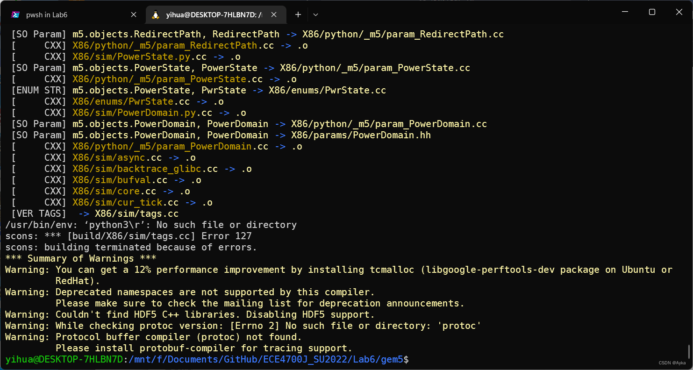

先执行 git config 命令配置好代理，然后执行

```bash
git clone https://gem5.googlesource.com/public/gem5
cd gem5
scons build/X86/gem5.opt -j 12
```

这里 -j 后的内容代表同时执行的工作数，即使是单核处理器，SCons -Q 命令也会默认指定 -j 2。如果指定 -j 1，需要花费数小时时间才能构建完成，但如果用满 CPU，只需一个多小时就可以构建完成。对于 6 核 12 线程（逻辑处理器），一般指定 -j 6 及以上就可以用满 CPU。

显示

> scons: Reading SConscript files ...
>
> You're missing the gem5 style or commit message hook. These hooks help
> to ensure that your code follows gem5's style rules on git commit.
> This script will now install the hook in your .git/hooks/ directory.
> Press enter to continue, or ctrl-c to abort:

回车。Windows 是无法安装 gem5 的，回车会出现

> Error updating git pre-commit hook
> OSError: [WinError 1314] 客户端没有所需的特权。: '..\\..\\util\\git-pre-commit.py' -> 'F:\\Documents\\GitHub\\ECE4700J_SU2022\\Lab6\\gem5\\.git\\hooks\\pre-commit':
>   File "F:\Documents\GitHub\ECE4700J_SU2022\Lab6\gem5\SConstruct", line 177:
>     main = Environment(tools=[
>   File "E:\Program_Files\Python310\lib\site-packages\SCons\Environment.py", line 1010:
>     apply_tools(self, tools, toolpath)
>   File "E:\Program_Files\Python310\lib\site-packages\SCons\Environment.py", line 116:
>     _ = env.Tool(tool)
>   File "E:\Program_Files\Python310\lib\site-packages\SCons\Environment.py", line 1879:
>     tool(self)
>   File "E:\Program_Files\Python310\lib\site-packages\SCons\Tool\__init__.py", line 273:
>     self.generate(env, *args, **kw)
>   File "F:\Documents\GitHub\ECE4700J_SU2022\Lab6\gem5\site_scons\site_tools\git.py", line 120:
>     install_style_hooks(env)
>   File "F:\Documents\GitHub\ECE4700J_SU2022\Lab6\gem5\site_scons\site_tools\git.py", line 115:
>     hook_install("pre-commit", git_style_script)
>   File "F:\Documents\GitHub\ECE4700J_SU2022\Lab6\gem5\site_scons\site_tools\git.py", line 94:
>     os.symlink(script_path, hook.get_abspath())

以管理员身份运行 PowerShell 执行 scons 命令，在上述回车后会显示

> TypeError: 'NoneType' object is not callable:
>   File "F:\Documents\GitHub\ECE4700J_SU2022\Lab6\gem5\SConstruct", line 182:
>     main.Tool(SCons.Tool.FindTool(['gcc', 'clang'], main))
>   File "E:\Program_Files\Python310\lib\site-packages\SCons\Environment.py", line 1879:
>     tool(self)

显示 scons 并未找到 gcc 或 clang（可参考十年前的 mailinglist archive：problems when compiling (narkive.com)）。该检查位于 SConstruct 文件的第 182~183 行：

```python
main.Tool(SCons.Tool.FindTool(['gcc', 'clang'], main))
main.Tool(SCons.Tool.FindTool(['g++', 'clang++'], main))
```

如果使用虚拟机打开，应将 gem5 克隆到虚拟机磁盘内，而不要使用挂载在 /mnt/hgfs 的克隆，否则会在上述回车后报错

> FileNotFoundError: [Errno 2] No such file or directory: "/mnt/hgfs/Documents/Senior/ECE4700J,Computer Architecture/Lab #6/gem5/fatal: unsafe repository ('/mnt/hgfs/Documents/Senior/ECE4700J,Computer Architecture/Lab #6/gem5' is owned by someone else)\nTo add an exception for this directory, call:\n\n\tgit config --global --add safe.directory '/mnt/hgfs/Documents/Senior/ECE4700J,Computer Architecture/Lab #6/gem5'/hooks":
>   File "/mnt/hgfs/Documents/Senior/ECE4700J,Computer Architecture/Lab #6/gem5/SConstruct", line 177:
>     main = Environment(tools=[
>   File "/home/ayka-tsuzuki/.local/lib/python3.10/site-packages/SCons/Environment.py", line 1010:
>     apply_tools(self, tools, toolpath)
>   File "/home/ayka-tsuzuki/.local/lib/python3.10/site-packages/SCons/Environment.py", line 116:
>     _ = env.Tool(tool)
>   File "/home/ayka-tsuzuki/.local/lib/python3.10/site-packages/SCons/Environment.py", line 1879:
>     tool(self)
>   File "/home/ayka-tsuzuki/.local/lib/python3.10/site-packages/SCons/Tool/__init__.py", line 273:
>     self.generate(env, *args, **kw)
>   File "/mnt/hgfs/Documents/Senior/ECE4700J,Computer Architecture/Lab #6/gem5/site_scons/site_tools/git.py", line 120:
>     install_style_hooks(env)
>   File "/mnt/hgfs/Documents/Senior/ECE4700J,Computer Architecture/Lab #6/gem5/site_scons/site_tools/git.py", line 115:
>     hook_install("pre-commit", git_style_script)
>   File "/mnt/hgfs/Documents/Senior/ECE4700J,Computer Architecture/Lab #6/gem5/site_scons/site_tools/git.py", line 78:
>     os.mkdir(git_hooks.get_abspath())


我们在这里用 WSL 安装，打开 WSL Ubuntu（注意，zsh 打开 gem5 目录会卡住不动，所以应全程使用 bash），cd 到克隆文件夹下执行 scons 命令，在上述回车后即可成功开始安装：


然而，构建在 [VER TAGS]  -> X86/sim/tags.cc 出错误停止，报错：

> [VER TAGS]  -> X86/sim/tags.cc
> /usr/bin/env: ‘python3\r’: No such file or directory
> scons: \*** [build/X86/sim/tags.cc] Error 127
> scons: building terminated because of errors.
> \*** Summary of Warnings ***
> Warning: You can get a 12% performance improvement by installing tcmalloc (libgoogle-perftools-dev package on Ubuntu or
>          RedHat).
> Warning: Deprecated namespaces are not supported by this compiler.
>          Please make sure to check the mailing list for deprecation announcements.
> Warning: Couldn't find HDF5 C++ libraries. Disabling HDF5 support.
> Warning: While checking protoc version: [Errno 2] No such file or directory: 'protoc'
> Warning: Protocol buffer compiler (protoc) not found.
>          Please install protobuf-compiler for tracing support.



研究 gem5 源码，报错位置在 src/SConscript 的第 644-647 行：

```python
tags = \
env.Command('sim/tags.cc', None,
            MakeAction('util/cpt_upgrader.py --get-cc-file > $TARGET',
                       Transform("VER TAGS")))
```

这里的 env 是主目录的 SConstruct 文件中第 720 行

```python
exports=['env', 'gem5py_env']
```

导出让所有子目录下的 SConscript 文件可以直接使用的，而 env 是在第 366 行

```python
env = main.Clone()
```

从 main 克隆而来的，且中间的修改没有关键影响，而 main 是第 177-180 行

```python
main = Environment(tools=[
        'default', 'git', TempFileSpawn, EnvDefaults, MakeActionTool,
        ConfigFile, AddLocalRPATH, SwitchingHeaders, TagImpliesTool, Blob
    ])
```

定义的，且中间的修改没有关键影响，这里 python 实际上就是 'default' 引入的。通过学习 SCons，可编写以下最小可工作样例 SConstruct 文件：

```python
env = Environment()
tags = env.Command('sim/tags.cc', None, 'util/cpt_upgrader.py --get-cc-file > $TARGET')
```


其中，Environment() 与 Environment(tools=['default']) 等价，env.Command 的第 3 个参数 action 等价于 SCons.Script.Action('util/cpt_upgrader.py --get-cc-file > $TARGET')，然后在命令行执行 scons 命令，输出：

> scons: Reading SConscript files ...
> scons: done reading SConscript files.
> scons: Building targets ...
> util/cpt_upgrader.py --get-cc-file > sim/tags.cc
> /usr/bin/env: 'python3\r': No such file or directory
> scons: *** [sim/tags.cc] Error 127

查看 util/cpt_upgrader.py，直接执行

```python
python util/cpt_upgrader.py --get-cc-file
```

可生成一段代码重定向到 $TARGET 也就是 sim/tags.cc 中：

```c++
// this file is auto-generated by util/cpt_upgrader.py
#include <string>
#include <set>

namespace gem5
{

std::set<std::string> version_tags = {
  "arm-ccregs",
  "arm-contextidr-el2",
  "arm-gem5-gic-ext",
  "arm-gicv2-banked-regs",
  "arm-hdlcd-upgrade",
  "arm-miscreg-teehbr",
  "arm-sve",
  "arm-sysreg-mapping-ns",
  "armv8",
  "cpu-pid",
  "dvfs-perflevel",
  "etherswitch",
  "globals-to-root",
  "ide-dma-abort",
  "isa-is-simobject",
  "memory-per-range",
  "mempool-sections",
  "mempool-to-seworkload",
  "multiple-event-queues",
  "process-fdmap-rename",
  "remove-arm-cpsr-mode-miscreg",
  "ruby-block-size-bytes",
  "smt-interrupts",
  "x86-add-tlb",
};

} // namespace gem5
```

通过研究 SCons 源码知道，可以切换到工作目录下进入 Python，直接在 Python 命令行输入

```python
import SCons.Platform
SCons.Platform.Platform().name
import SCons.Environment
SCons.Environment.Environment()._dict
```

检查 Platform 为 'posix'，Environment 一个键为 'BUILDERS'、子键有 'Program'、'SharedLibrary' 等的大字典，其中子键 'ENV' 的值为 {"PATH": "/usr/local/bin:/opt/bin:/bin:/usr/bin:/snap/bin"}。然后参考 SCons/EnvironmentTests.py 中的 test_Command 函数执行

```bash
act = 'util/cpt_upgrader.py --get-cc-file > $TARGET'
env = SCons.Environment.Environment()
t = env.Command('sim/tags.cc', None, act)[0]
t.build()
```

同样可以复现错误：

> util/cpt_upgrader.py --get-cc-file > sim/tags.cc
> sh: 1: cannot create sim/tags.cc: Directory nonexistent
> Traceback (most recent call last):
>   File "<stdin>", line 1, in <module>
>   File "/mnt/f/Documents/GitHub/scons/SCons/Node/__init__.py", line 755, in build
>     self.get_executor()(self, **kw)
>   File "/mnt/f/Documents/GitHub/scons/SCons/Executor.py", line 384, in __call__
>     return _do_execute_map[self._do_execute](self, target, kw)
>   File "/mnt/f/Documents/GitHub/scons/SCons/Executor.py", line 120, in execute_action_list
>     raise status    # TODO pylint E0702: raising int not allowed
> SCons.Errors.BuildError: Error 2

这里的 t 是 SCons.Node.FS.Entry object 或 SCons.Node.FS.File object，其所在的列表只有 t 一个元素；t.builder 是 SCons.Builder.BuilderBase object；str(t) 为 'sim/tags.cc'。这里的函数调用链为 SCons.Environment.Base.Command -> SCons.Builder.BuilderBase.\_\_call\_\_ -> SCons.Builder.BuilderBase.\_execute -> SCons.Node.Node.build-> SCons.Node.Node.get_executor -> Scons.Executor.Executor.\_call\_\_ -> Scons.Executor.Executor._do_execute_map -> Scons.Executor.execute_action_list。这里为了复现

```python
env = obj.get_build_env()
kw = obj.get_kw(kw)
args = ([], [], env)
status = act(*args, **kw)
```

的行为，可在 Python 命令行中继续执行

```python
args = ([], [], env)
act_obj = t.get_executor().get_action_list()[0]
kw = t.get_executor().get_kw()
act_obj(*args, **kw)
```

可以直接复现错误。这里的 env 和 t.get_executor().get_build_env()、t.get_executor()._memo['get_build_env'] 是一样的。我们还可以执行

```bash
SCons.Debug.track_instances = True
```

重新执行 act_obj，会给出 SCons.Erros.BuildError 的具体信息：

> BuildError(None, 'Error 127', 127, 2, None, None, <SCons.Action.CommandAction object at 0x7f11f6dea3a0>, ['util/cpt_upgrader.py', '--get-cc-file', '>', '"sim/tags.cc"'], (None, None, None))

这里 act_obj 为 SCons.Action.CommandAction object，kw 为字典，键为 'executor'，值为 SCons.Executor.Executor object，env 为 SCons.Environment.Base object。CommandAction 类继承自 \_ActionAction 类，其 \_\_call\_\_ 函数调用子类的 execute 函数。env['SHELL'] 、env['SPAWN'] 和 env['ESCAPE'] 对于 posix 系统而言都定义在 SCons/Platform/posix.py 中，分别是 'sh'、subprocess_spawn -> subprocess_spawn -> exec_subprocess -> subprocess.Popen 和 escape。对于 ENV 变量而言，_resolve_shell_env 函数中 shell_gen = env.get('SHELL_ENV_GENERATORS') 为空，ENV = get_default_ENV(env) 也就是 env['ENV']。因此，SCons 实际执行的命令就是直接执行

```bash
sh -c util/cpt_upgrader.py --get-cc-file > sim/tags.cc
```

而不手动指定 Python 编译器。因为 util/cpt_upgrader.py 的第一行的 shebang 是

```python
#!/usr/bin/env python3
```

所以在 WSL 中直接执行上述命令时注意到文件行尾序列为 CRLF 而非 LF，因此才导致错误读入 \r，注意到在 PowerShell 中克隆 gem5 源码时，执行

```powershell
git config --list
```

其中有一条配置：core.autocrlf=true，所以才导致 git clone 时自动将行尾序列从 LF 转换到 CRLF，可参考 [linux - Git replacing LF with CRLF - Stack Overflow](https://stackoverflow.com/questions/1967370/git-replacing-lf-with-crlf) 修改，也可参考 [How do I convert all files in a folder to a different line ending? (on Windows) - Super User](https://superuser.com/questions/757081/how-do-i-convert-all-files-in-a-folder-to-a-different-line-ending-on-windows) 和 [Recursively Change Line Endings (Windows) (github.com)](https://gist.github.com/kelvinn/512f72bf1015047af945)  执行

```bash
sudo apt install dos2unix
find gem5 -type f -exec dos2unix {} \;
```

递归地转换 gem5 文件夹下的所有文件：


完成后，重新执行构建命令即可成功：


执行

```python
pip install pydot
build/X86/gem5.opt configs/learning_gem5/part1/simple.py
```


测试成功。
