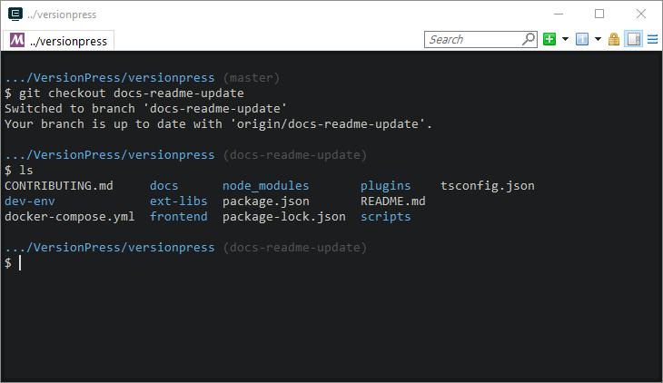

---
title: MSYS2 Zsh
categories: SuperUser
tags:
  - git
  - msys
  - msys2
  - zsh
  - ohmyzsh
date: 2022-08-22 09:24:48
---

本文翻译自 [Zsh on Windows via MSYS2](https://medium.com/@borekb/zsh-via-msys2-on-windows-3964a943b1ce)，作者是 [Borek Bernard](https://medium.com/@borekb)。

我有相当长的历史试图让 “Linux-y” 环境在 Windows 上工作，从增强的 `cmd.exe` 到 WSL 到 Git Bash。我仍然认为 Git Bash 对大多数人来说是最好的中间地带：超级容易安装（[Git for Windows](https://gitforwindows.org/)），很少有问题，你可以在 Linux / macOS 机器上做几乎任何你想做的事情，例如，`rm -rf node_modules`，单引号，Bash 脚本等。唯一的限制是 Git Bash 附带了一组固定的实用工具——可以理解为该项目只维护与 Git 直接相关的工具。所以当你在寻找 `rsync` 时，你只能靠自己。zsh 也是如此，基本上其他所有东西也是如此。
我最近[开始使用 Mac](https://medium.com/@borekb/setting-up-mac-for-development-notes-from-a-windows-user-d4028535dc49)，zsh 尤其成为了优先考虑的对象，我重新考虑了 Windows 上的工具链。最后，我切换到 MSYS2，在其中安装了 Git for Windows，它也为我解锁了许多其他的软件包。这是我迄今为止发现的最好的设置，所以我想分享它。
> 关于 WSL 的说明：我在理论上喜欢它，并且认为它可能会使 Windows 在未来成为最好的开发平台（真正的 Linux 实用程序，本机 Docker 等），但在实践中使用它对我来说相当麻烦，因为一个人只是在一个不同的操作系统中。例如，从 Windows 访问安装在 WSL 中的工具不是那么容易，用户不同，在机器之间同步系统设置的工作方式不同，更新是独立的，等等。使用 MSYS2 ，只有一个操作系统：Windows。
## MSYS2
Git for Windows 是基于 MSYS2 构建的，而整个设置的关键是：从 [MSYS2](https://www.msys2.org/) 开始，在其中安装 Git for Windows。这将允许我们继续超越它的边界，使用 rsync 或 make 这样的工具。
MSYS2 这个项目在他们的 wiki 上有一个很好的介绍：
- MSYS2 由三个相对独立的子系统组成：MSYS2、mingw32 和 mingw64。
- msys2 是一个模拟层——完全兼容 POSIX，但速度很慢。
- mingw 子系统提供了原生的 Windows 二进制文件，在编译时将 Linux 调用重写为它们的 Windows 对等文件。例如，Git for Windows 是一个 `mingw64` 二进制文件（不像 msys Git 利用了兼容层，因此很慢）。
- 每个子系统都有自己的 Shell，选择正确的 Shell 很重要。msys shell有一个以 `/usr/local/bin:/usr/bin:/bin:…` 开始的 PATH，而 mingw64 shell 在它前面添加了 `/mingw64/bin`。这意味着 `/mingw64/bin/git.exe` 只在 mingw64 shell 中可用。
- MSYS2 自带 Pacman，一个从 Arch Linux 移植过来的包管理器，还有许多可以通过 `pacman -S <package>` 安装的包。

从 https://www.msys2.org/ 下载 64 位 MSYS2 并安装。运行：
```bash
pacman -Syu # repeat if necessary
pacman -Su
```
当询问时，完全关闭终端，并通过开始菜单快捷方式 “MSYS2 MSYS” 重新启动它。
现在已经安装和更新了基本环境。关闭终端。
## #HOME
默认情况下，`$HOME` 是 `/home/You` （`C:\msys64\home\You`）。让我们将其切换到 `C:\Users\You` 以使你的 `.gitconfig` 能够工作。
最好的办法是添加 Windows 环境变量 `HOME = C:\Users\You`。我还尝试了其他方法，比如更新 `C:\msys64\etc\profile` 或 `C:\msys64\etc\bash.bashrc`，但这不通用。
**更新**：对于 openssh 以及其他很多程序，修改 `C:\msys64\etc\nsswitch.conf` 中的 `db_home` 行为：
```
db_home: windows cygwin desc
```
## ConEmu MinGW Shell
让我们切换到一个更好的终端：[ConEmu](https://conemu.github.io/)。
这里我将推荐一件有争议的事情：从现在开始只使用 mingw64 shell。这与[官方 wiki](https://github.com/msys2/msys2/wiki/MSYS2-introduction#path) 相反，他们建议在 msys shell 中运行 Pacman，但是：
- 我没有遇到从 mingw shell 安装包的任何问题。
- 我在 msys shell 中安装 mingw-w64-x86_64-git-lfs 时遇到了问题，因为它使用 git 作为安装的一部分，而 git 并不在 msys 的 PATH 中。
- 担心两个 Shell，两个 ConEmu 任务，两个 PATH 配置等等是不值得的。

所以在本节中，我们将只设置一个 ConEmu 为 mingw64。如果你需要 msys shell，请使用 Windows 开始菜单中的 “MSYS2 msys” 快捷方式。
我的 MSYS2::mingw ConEmu 任务如下：
```
set CHERE_INVOKING=1 & set MSYSTEM=MINGW64 & set MSYS2_PATH_TYPE=inherit & set “PATH=%ConEmuDrive%\msys64\mingw64\bin;%ConEmuDrive%\msys64\usr\bin;%PATH%” & %ConEmuBaseDirShort%\conemu-msys2–64.exe -new_console:p %ConEmuDrive%\msys64\usr\bin\bash.exe — login -i -new_console:C:”%ConEmuDrive%\msys64\msys2.ico”
```
它是默认的 {Bash::Msys2-64} 任务的副本，设置了 MSYSTEM 变量（使其成为一个mingw shell），并扩展了 PATH 以包含完整的 Windows 路径，这样就可以访问系统范围的二进制文件，如 `node`、`yarn` 或 `kubectl`。如果你需要确认你在运行哪个 Shell，可以执行 `echo $MSYSTEM`。
## 必不可少的工具
```bash
pacman -S man vim nano
pacman -S openssh rsync make
pacman -S zip unzip
pacman -S mingw64/mingw-w64-x86_64-jq
```
> 关于 sudo 的说明：MSYS2 不提供。参考[这个问题](https://superuser.com/questions/122418/theres-no-sudo-command-in-cygwin)或 [imachug/win-sudo](https://github.com/imachug/win-sudo)。

## Git for Windows
如果你之前安装了 Git for Windows，卸载它或者从 PATH 直接删除 `C:\Program Files\Git\...`。

现在让我们把 GfW 安装到 MSYS2。大多数说明都来自[这个 wiki 页面](https://github.com/git-for-windows/git/wiki/Install-inside-MSYS2-proper)，但我必须对它进行一些定制。

首先，编辑 `C:\msys64\etc\pacman.conf` 并添加以下内容：
```
[git-for-windows]
Server = https://wingit.blob.core.windows.net/x86-64
```
它需要放在 [mingw32] 作为第一个仓库，这样它包含的包将会被首先安装。对签名密钥进行授权：
```bash
curl -L https://raw.githubusercontent.com/git-for-windows/build-extra/master/git-for-windows-keyring/git-for-windows.gpg |
pacman-key --add - &&
pacman-key --lsign-key 1A9F3986
```
在原位用新的仓库更新安装：
```bash
pacman -Syu
```
这将指导你安装一个新的 msys2 运行时。你必须完全退出终端，并像以前一样再次运行更新命令。重复 `pacman -Syu`，直到没有更多的东西要更新。
现在安装 Git for Windows：
> 这里用的是 `pacboy`。它是一个小的包装器，可以节省一些输入，例如， `pacboy sync git:x` 等价于 `pacman -S mingw-w64-x86_64-git`（“:x”表示我们想要x64版本）。
```bash
pacboy sync git:x git-credential-manager:x git-lfs:x git-doc-html:x git-doc-man:x
```
检查所有东西工作正常：
```bash
git --version
git config --list --show-origin
# ... verifies that your ~/.gitconfig is read
```
你应该能够从 GitHub pull，证书助手应该存储你的 HTTPS 密码。

## 更新 Windows PATH
为了使 Git 和其他工具如 `cp` 或 `rm -rf` 也可以在 `cmd.exe` 和其他 shell 中使用，按以下顺序添加到你的 PATH（我建议首先加载系统路径）:
```
C:\msys64\mingw64\bin
C:\msys64\usr\bin
```
检查：
> Microsoft Windows [Version 10.0.17134.112]
(c) 2018 Microsoft Corporation. All rights reserved.
C:\Users\Borek>git --version
git version 2.18.0.windows.1
C:\Users\Borek>ls -la
...

## Zsh
```bash
pacman -S zsh
```
ConEmu 任务和我们之前创建的差不多，只是将 `bash.exe` 换成 `zsh.exe`。这是我的 `{MSYS2:zsh}` 任务：
```
set CHERE_INVOKING=1 & set MSYSTEM=MINGW64 & set MSYS2_PATH_TYPE=inherit & set “PATH=%ConEmuDrive%\msys64\mingw64\bin;%ConEmuDrive%\msys64\usr\bin;%PATH%” & %ConEmuBaseDirShort%\conemu-msys2–64.exe -new_console:p %ConEmuDrive%\msys64\usr\bin\zsh.exe — login -i -new_console:C:”%ConEmuDrive%\msys64\msys2.ico”
```
[这篇文章](https://dzone.com/articles/install-oh-my-zsh-on-windows-with-conemu)提供了一个基于 mintty 的 ConEmu 任务示例，但我认为 `conEmu -msys2-64.exe` 是首选的方式，请参阅[这里](https://conemu.github.io/en/CygwinMsysConnector.html)。
## Oh My Zsh
虽然我觉得 [omz](https://github.com/robbyrussell/oh-my-zsh) 有点臃肿（例如，它的 `git` 插件注册了大约 [100 万个别名](https://github.com/robbyrussell/oh-my-zsh/wiki/Plugin:git)），所以我喜欢启用 omz 来获取它的 [`lib`文件夹](https://github.com/robbyrussell/oh-my-zsh/tree/master/lib) 中所有有用的东西，但不启用任何插件或主题。我喜欢通过 [Antigen](https://github.com/zsh-users/antigen) 安装 omz 和其他东西。首先，将以下内容加入 `.zshrc`：
> 实际上,我的 `~/.zshrc` 只是 source 了 `$HOME/GDrive/Settings/zsh/.zshrc`，这样它就能在电脑间同步了。我可能很快就会改用版本化的 dotfiles 方法。

```
# Use the path where you installed Antigen
source "${funcsourcetrace[1]%/*}/antigen.zsh"
# Load Oh My Zsh
antigen use oh-my-zsh
# Example of how to add other useful things
antigen bundle zsh-users/zsh-completions
antigen apply
```
对于我而言 `.zshrc` 中其他重要的东西包括：
```
# Make /c/... autocompletion work, see Alexpux/MSYS2-packages#38
zstyle ':completion:*' fake-files /: '/:c'
# Convenient path navigation, e.g., `cd vp`
setopt CDABLE_VARS
vp="/c/Dev/VersionPress/versionpress"
temp="/c/Dev/temp"
# VSCode as an editor
if [[ -n $SSH_CONNECTION ]]; then
  export EDITOR='vim'
else
  export EDITOR='code-insiders --wait'
fi
```
## 提示符
有无数的 zsh 提示符，但正如预期的那样，没有一个是*非常*完美的。我想从提示符中得到几个关键信息:

1. 它应该是简单的，就像 [Pure](https://github.com/sindresorhus/pure)。
2. 它必须是异步的，以便查询 Git 信息不会阻碍实际的工作。*

> * 译者注：这一点的确很重要。

第二点在Windows上实现相对比较困难，因为大多数异步提示符（包括 Pure）依赖于 `zsh-async`，它依赖于 `zsh/zpty`，这在 MSYS2 中不起作用（直到一些回退被实现，见 [mafredri/zsh-async#26](https://github.com/mafredri/zsh-async/issues/26)）。我发现在 Windows 上工作的唯一异步提示符是 [agkozak/agkozak-zsh-theme](https://github.com/agkozak/agkozak-zsh-theme)。我不喜欢它的一些细节，例如 Git 信息在右侧提示符中，所以我有自己的一个 fork。在我的 `.zshrc` 中：
```
antigen theme borekb/agkozak-zsh-theme@prompt-customization
```
效果长这样：

我们现在有了一个完整的工作环境，包括MSYS2、zsh、Oh My zsh、Git for Windows 和 Pacman，其中添加新包就像 `pacman -S <something>` 一样简单。这是我迄今为止发现的最好的设置，如果你有任何建议，请在下面的评论中告诉我。

非常感谢所有参与 MSYS2 和 Git for Windows 项目的人，你们让 Windows 开发人员的生活变得可以忍受！

