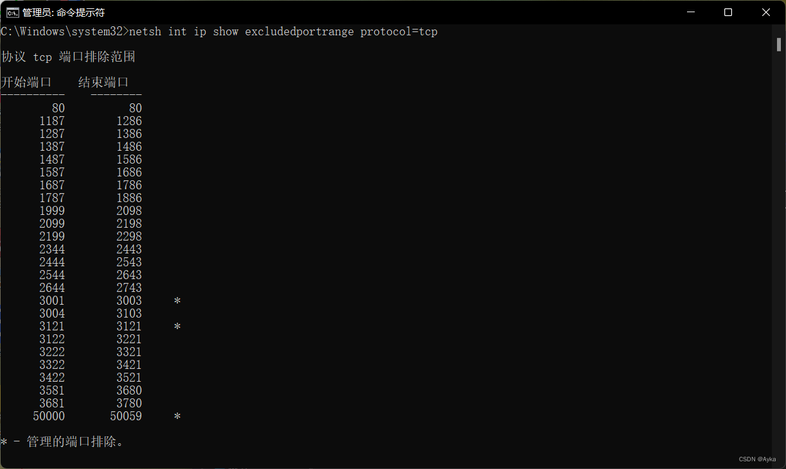
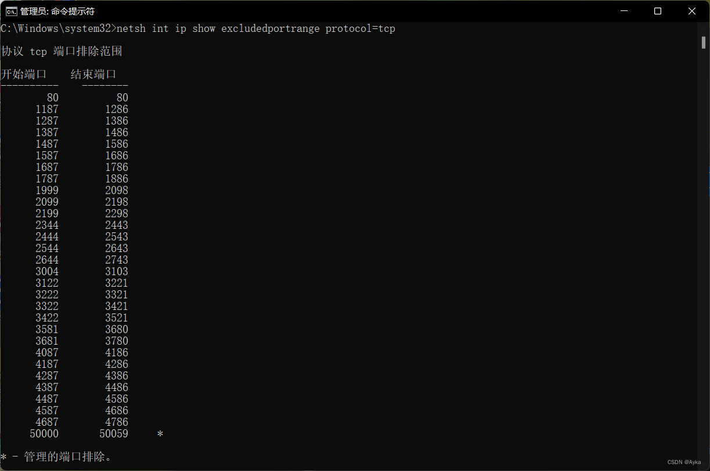

---
title: netsh int ip 添加/删除 TCP 协议 excludedportrange 的方法
categories: SuperUser
tags:
  - tcp/ip
  - 网络
  - 服务器
  - netsh
date: 2022-09-13 22:16:08
---

本文参考[Many excludedportranges how to delete - hyper-v is disabled](https://superuser.com/questions/1579346/many-excludedportranges-how-to-delete-hyper-v-is-disabled)。
以管理员身份运行命令提示符，运行：
```
netsh int ip show excludedportrange protocol=tcp
```
查看当前协议为 TCP 的 excludedportrange 为：

> 协议 tcp 端口排除范围
>
> 开始端口    结束端口
> \----------    --------
>      80          80
>    1057        1156
>    1190        1289
>    1290        1389
>    1390        1489
>    1490        1589
>    1590        1689
>    2544        2643
>    2644        2743
>    2744        2843
>    2844        2943
>    2944        3043
>    3044        3143
>    3144        3243
>    3986        4085
>    4086        4185
>    4186        4285
>    4286        4385
>    6490        6589
>    6590        6689
>    6790        6889
>    6890        6989
>   12711       12810
>   12911       13010
>   13011       13110
>   13117       13216
>   13317       13416
>   13417       13516
>   13524       13623
>   13758       13857
>   13858       13957
>   14394       14493
>   14532       14631
>   14632       14731
>   14732       14831
>   14832       14931
>   50000       50059     *
>
> \* - 管理的端口排除。

执行
```
net stop winnat
```
停止 WinNAT 服务。这时协议为 TCP 的 excludedportrange 会被自动重置为 80 - 80 等范围。执行
```
netsh int ip add excludedportrange protocol=tcp numberofports=1 startport=3121
netsh int ip add excludedportrange protocol=tcp numberofports=3 startport=3001
```
添加范围 3121 - 3121 与 3001 - 3003。执行
```
netsh int ip reset
```
重置 IP Interface。重启计算机。此时查看当前协议为 TCP 的 excludedportrange 为：

可以看到我们需要的两段范围已标星号。执行

```
netsh int ip delete excludedportrange protocol=tcp numberofports=1 startport=3121
netsh int ip delete excludedportrange protocol=tcp numberofports=3 startport=3001
```
此时查看当前协议为 TCP 的 excludedportrange 为：

成功删除范围 3121 - 3121 与 3001 - 3003。
