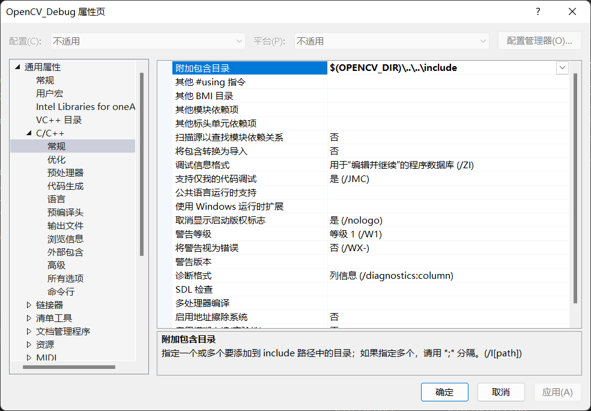
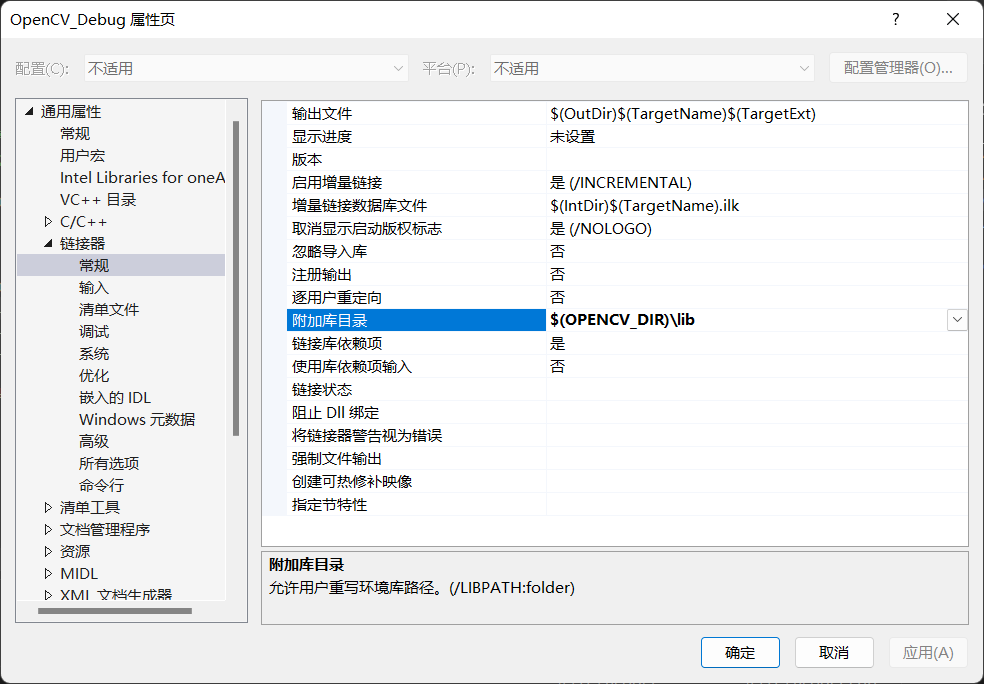

本文来源于 [Set the OpenCV environment variable and add it to the systems path](https://docs.opencv.org/4.x/d3/d52/tutorial_windows_install.html#tutorial_windows_install_path) 与 [How to build applications with OpenCV inside the "Microsoft Visual Studio"](https://docs.opencv.org/4.x/dd/d6e/tutorial_windows_visual_studio_opencv.html)。

 1. 对于 Visual Studio 2017、2019 及 2022 版本，以管理员方式运行
```bat
setx -m OPENCV_DIR D:\Resources\opencv\build\x64\vc15
```
或直接在高级系统设置->环境变量(N)...中新建系统变量，变量名(N)为 OPENCV_DIR，变量值(V) 为 opencv\build\x64\vc15 所在的文件夹。
 2. 选择系统变量 Path，点击“编辑(I)...”，在编辑环境变量窗口中点击“新建(N)”，新建 `%OPENCV_DIR%\bin` 。
 3. 重启 Visual Studio。
 4. Visual Studio 菜单栏->视图->其他窗口(E)->属性管理器(M)。
 5. 在属性管理器窗口中，展开解决方案，右键 Debug | 64，点击“添加新项目属性表(P)...”。
 6. 在“添加新项”窗口中，选择“属性表(.props)”，名称可以叫做 OpenCV_Debug，点击“添加(A)”。
 7. 展开 Debug | x64，双击 OpenCV_Debug 或右键 OpenCV_Debug，点击“属性(R)”或 Alt+Enter。在 OpenCV_Debug 属性页窗口中，展开“通用属性”，展开“C/C++”，在常规选项卡中，在“附加包含目录”一栏添加 `$(OPENCV_DIR)\..\..\include`。

 8. 展开“链接器”，在常规选项卡中，在“附加库目录”一栏添加 `$(OPENCV_DIR)\lib`。
9. 同样在“链接器”下，打开“输入”选项卡，在“附加依赖项”一栏添加 `opencv_world460d.lib`。这里该对象文件库文件名末尾的 “d” 表示该库仅用于 Debug（调试）。然后点击“确定”。
10.  如有需要，也可以对 Release | x64 做同样配置，但是注意在链接器->输入->附加依赖项添加的是 `opencv_world460.lib`。