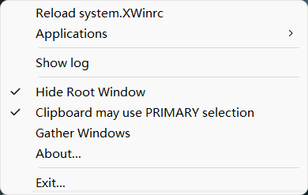
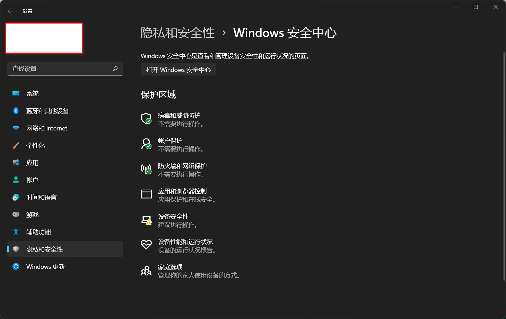
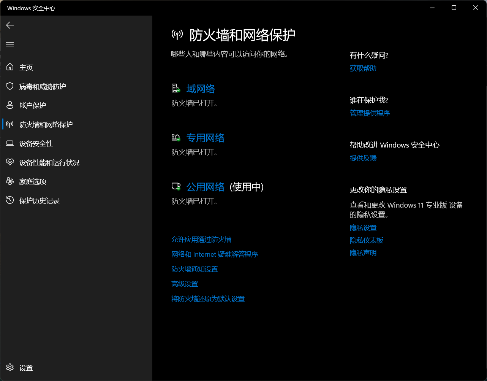
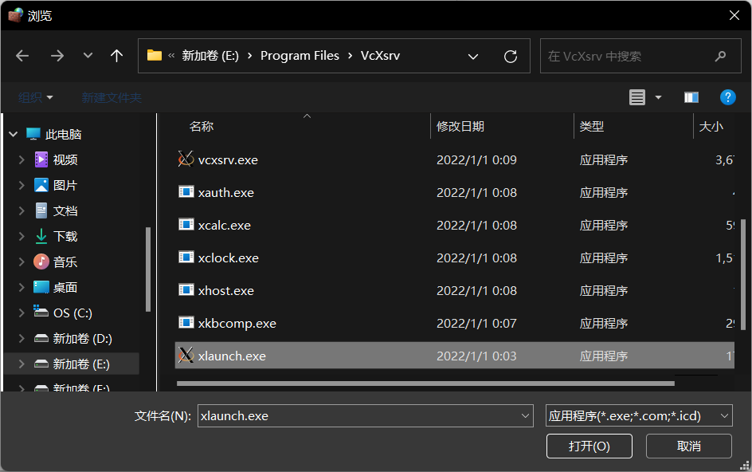
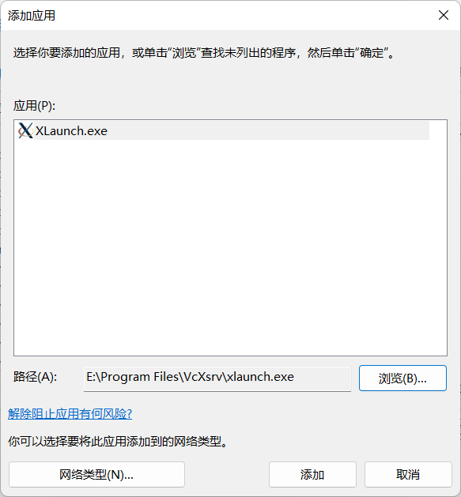
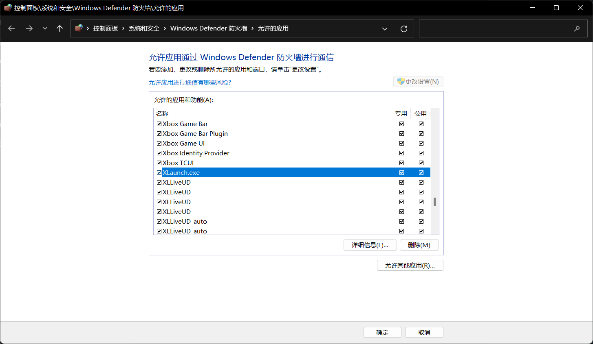
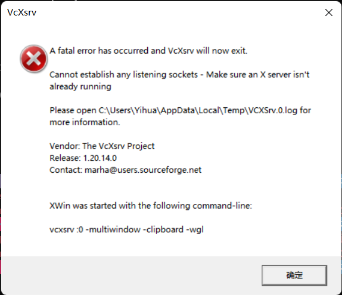

在通过 VcXsrv 配置 X11 forwarding 时，打开 XLaunch，却屡次在启动后闪退，而 VcXsrv 主程序却能正常启动。通过
```bat
net stop winnat
```
取消端口排除范围后仍然闪退。经过反复研究，通过右键单击通知区域（即原托盘区）XLaunch 图标，单击“Show Log”：

这将打开 C:\Users\\<username\>\AppData\Local\Temp\VCXSrv.0.log。日志文件中记录：

```text
Welcome to the VcXsrv X Server
Vendor: The VcXsrv Project
Release: 1.20.14.0

OS: Windows NT 6.2 build 9200 (64-bit)
Contact: marha@users.sourceforge.net

_XSERVTransSocketCreateListener: failed to bind listener
_XSERVTransSocketINETCreateListener: ...SocketCreateListener() failed
_XSERVTransMakeAllCOTSServerListeners: failed to create listener for inet6
_XSERVTransSocketCreateListener: failed to bind listener
_XSERVTransSocketINETCreateListener: ...SocketCreateListener() failed
_XSERVTransMakeAllCOTSServerListeners: failed to create listener for inet
LoadPreferences: F:\Cadence\SPB_Data\.XWinrc not found
LoadPreferences: Loading E:\Program Files\VcXsrv\system.XWinrc
(II) AIGLX: Testing pixelFormatIndex 1
(II) GLX: enabled GLX_SGI_make_current_read
(II) GLX: enabled GLX_SGI_swap_control
(II) GLX: enabled GLX_MESA_swap_control
(II) GLX: enabled GLX_SGIX_pbuffer
(II) GLX: enabled GLX_ARB_multisample
(II) GLX: enabled GLX_SGIS_multisample
(II) GLX: enabled GLX_ARB_fbconfig_float
(II) GLX: enabled GLX_EXT_fbconfig_packed_float
(II) GLX: enabled GLX_ARB_create_context
(II) GLX: enabled GLX_ARB_create_context_profile
(II) GLX: enabled GLX_ARB_create_context_robustness
(II) GLX: enabled GLX_EXT_create_context_es2_profile
(II) GLX: enabled GLX_ARB_framebuffer_sRGB
(II) AIGLX: enabled GLX_MESA_copy_sub_buffer
(II) 110 pixel formats reported by wglGetPixelFormatAttribivARB
(II) GLX: Initialized Win32 native WGL GL provider for screen 0
winMultiWindowXMsgProc - Could not open display, try: 1, sleeping: 5
winInitMultiWindowWM - Could not open display, try: 1, sleeping: 5
```
参考 [#80 VcXsrv exits after launch](https://sourceforge.net/p/vcxsrv/bugs/80/) 的提示，可能是 Windows 防火墙的问题，在 Window 设置中切换到“隐私和安全性”选项卡，点击“打开 Windows 安全中心”：

在 Windows 安全中心主页，点击“防火墙和网络保护”，或切换到“防火墙和网络保护”选项卡，点击“允许应用通过防火墙”：

在打开的“控制面板\系统和安全\Windows Defender 防火墙\允许的应用”的“允许应用通过 Windows Defender 防火墙进行通信”的页面中，浏览“允许的应用和功能(A)”列表，查看是否有“VcXsrv windows xserver”和“XLaunch.exe”两项，如果没有，点击左上角的“更改设置(N)”按钮，这时右下角的“允许其他应用(R)...”按钮可用，点击，打开”添加应用“对话框，点击”浏览(B)...“，找到 VcXsrv 安装路径，在安装目录下找到 XLaunch.exe：

然后点击“添加”：

添加后，XLaunch.exe 就会出现在“允许的应用和功能(A)”列表中，确认“专用”列和“共用”列都已打钩：

如果“允许的应用和功能(A)”列表中没有 VcXsrv windows xserver，以同样的方式添加 VcXsrv.exe 并勾选专用列和公用列。
无需以管理员身份运行 XLaunch，打开“Display settings”对话框以 Select display settings，可保持 Display number 为 -1 或指定为 0，点击“下一页(N) >”。在“Client startup”页 Select how to start clients，保持默认 Start no client，点击“下一页(N) >”。在“Extra setting”页，勾选 Clipboard、Primary Selection、Native opengl，一般无需勾选 Disable access control，Addtional parameters for VcXsrv 留空，点击“下一页(N) >”。如有需要，可以点击“Save configuration”按钮保存设置，点击“完成”。这时右下角通知区域（原托盘区)显示 XLaunch 图标，同样展开右键菜单点击 Show Log，查看日志文件显示：

```text
Welcome to the VcXsrv X Server
Vendor: The VcXsrv Project
Release: 1.20.14.0

OS: Windows NT 6.2 build 9200 (64-bit)
Contact: marha@users.sourceforge.net

LoadPreferences: F:\Cadence\SPB_Data\.XWinrc not found
LoadPreferences: Loading E:\Program Files\VcXsrv\system.XWinrc
(II) AIGLX: Testing pixelFormatIndex 1
(II) GLX: enabled GLX_SGI_make_current_read
(II) GLX: enabled GLX_SGI_swap_control
(II) GLX: enabled GLX_MESA_swap_control
(II) GLX: enabled GLX_SGIX_pbuffer
(II) GLX: enabled GLX_ARB_multisample
(II) GLX: enabled GLX_SGIS_multisample
(II) GLX: enabled GLX_ARB_fbconfig_float
(II) GLX: enabled GLX_EXT_fbconfig_packed_float
(II) GLX: enabled GLX_ARB_create_context
(II) GLX: enabled GLX_ARB_create_context_profile
(II) GLX: enabled GLX_ARB_create_context_robustness
(II) GLX: enabled GLX_EXT_create_context_es2_profile
(II) GLX: enabled GLX_ARB_framebuffer_sRGB
(II) AIGLX: enabled GLX_MESA_copy_sub_buffer
(II) 110 pixel formats reported by wglGetPixelFormatAttribivARB
(II) GLX: Initialized Win32 native WGL GL provider for screen 0
winClipboardThreadProc - DISPLAY=127.0.0.1:0.0
winClipboardProc - xcb_connect () returned and successfully opened the display.
Using Composite redirection
```
运行成功。
无需以管理员身份运行 PuTTY 连接 SSH 服务器，在 Category->Session 中的 Specify the destination you want to connect to 框中输入 Host Name (or IP address) 和 Port，可以在 Load, save or delete a stored session 中点击 Save 以保存当前会话或在 Saved Sessions 中点击之前保存的会话然后点击 Load 以加载之前的会话。在 Category->Connection->SSH->X11 的 X11 forwarding 框中勾选 Enable X11 forwarding。X display location 一般无需设置，留空即可，默认为 127.0.0.1:0.0 或略写为 :0.0。Remote X11 authentication protocol 选择 MIT-Magic-Cookie-1。X authority file for local display 一般无需选择，若选择应选择为 X server 的可执行文件程序。点击 Open。在打开的远程服务器的 Linux shell 中运行 gedit 尝试打开 gedit，成功。如果出现 `(gedit:163963): Gtk-WARNING **: cannot open display:` 错误，说明 PuTTY 设置未勾选 Enable X11 forwarding。
成功打开 gedit 后注意到 VCXsrv.0.log 日志结尾增加了
```text
winMultiWindowWMProc - Error code: 8 (Match), ID: 0x00180000, Major opcode: 12 (ConfigureWindow), Minor opcode: 0 ((null))
winMultiWindowWMProc - Error code: 8 (Match), ID: 0x00280001, Major opcode: 12 (ConfigureWindow), Minor opcode: 0 ((null))
winMultiWindowWMProc - Error code: 3 (Window), ID: 0x0020009c, Major opcode: 18 (ChangeProperty), Minor opcode: 0 ((null))
```
这类消息未必会对使用造成影响，正常使用即可。
除此之外，不要重复启动 X server，否则会无法启动或报错：

注意：在使用 VcXsrv 时，不要同时打开其他 X server 应用，比如 MobaXterm，否则会造成同样由于 failed to bind listener 的闪退，日志文件末尾为：
```text
winMultiWindowXMsgProc - another window manager is running.  Exiting.
(EE) Server terminated with error (1). Closing log file.
```