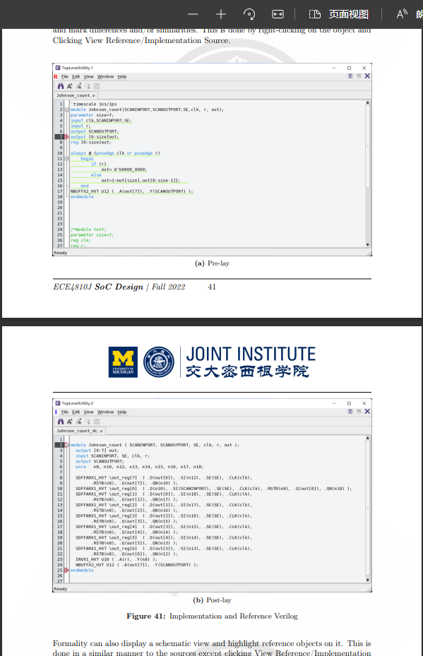

参考 [How to split subfigures over multiple pages (with a, b, c in one page, and d, e in second pages?](https://tex.stackexchange.com/questions/522500/how-to-split-subfigures-over-multiple-pages-with-a-b-c-in-one-page-and-d-e) 及 [Split subfigures over multiple pages](https://tex.stackexchange.com/questions/278727/split-subfigures-over-multiple-pages)。
**在预期放在下一页的第一张图片的 `\begin{figure}[H]` 处紧随其后加 `\ContinuedFloat`**
需要加 `subcaption` 及 `float` 包：
```latex
\usepackage{float}
\usepackage{subcaption}
```
样例：
```latex
\begin{figure}[H]
    \centering
    \begin{subfigure}{\textwidth}
        \includegraphics[width=\textwidth]{images/54.png}
        \subcaption{Pre-lay}
    \end{subfigure}
\end{figure}
\begin{figure}[H]\ContinuedFloat
    \centering
    \begin{subfigure}{\textwidth}
        \includegraphics[width=\textwidth]{images/55.png}
        \subcaption{Post-lay}
    \end{subfigure}
    \caption{Implementation and Reference Verilog}
\end{figure}
```

如果不用 `float` 包而使用传统 `!htbp` 浮动方式也可以，但是容易出问题。