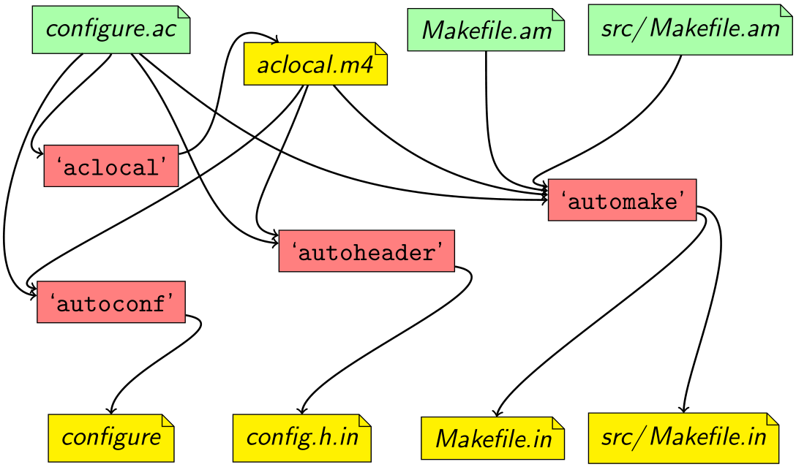

首先回顾构建 Flatpak 应用分为以下几步（https://docs.flatpak.org/en/latest/first-build.html）：
1. 安装一个运行时及其对应的 SDK
2. 创建一个应用，可以仅仅是一个脚本，也可以是基于 GNU Make、CMake、Meson 等工具的应用
3. 添加 manifest，可以是 YAML 也可以是 JSON
4. 使用 Flatpak Builder 命令构建应用：
```bash
flatpak-builder build-dir org.flatpak.Hello.yml
```
5. 测试构建：
```bash
flatpak-builder --user --install --force-clean build-dir org.flatpak.Hello.yml
flatpak run org.flatpak.Hello
```
6. 把应用放入一个仓库：
```bash
flatpak-builder --repo=repo --force-clean build-dir org.flatpak.Hello.yml
```
7. 安装应用（Flatpak 应用必须先安装才能运行）
```bash
flatpak --user remote-add --no-gpg-verify tutorial-repo repo
flatpak --user install tutorial-repo org.flatpak.Hello
```
8. 运行应用：
```bash
flatpak run org.flatpak.Hello
```
添加其他库的步骤就在第 3 步，在这一步我们可以将依赖集成到应用中，包括库、数据和其他资源（https://docs.flatpak.org/en/latest/dependencies.html）。我们以 JSON 为例：
现有 Flatpak 的 manifest 文件
```json
{
    "app-id" : "org.gnome.Example",
    "runtime" : "org.gnome.Platform",
    "runtime-version" : "43",
    "sdk" : "org.gnome.Sdk",
    "command" : "your-project",
    "finish-args" : [],
    "cleanup" : [],
    "modules" : [
        {
            "name" : "your-project",
            "builddir" : true,
            "buildsystem" : "meson",
            "sources" : [
                {
                    "type" : "git",
                    "branch" : "main",
                    "url" : "file:///home/ayka-tsuzuki/your-project"
                }
            ]
        }],
    "build-options" : {
        "env" : {        }
    }
}
```
假如我们要添加两个库，以`libcsv`和`xlsxwriter`为例，它们都是开源库，可以在 GitHub 上找到。浏览它们的 GitHub 仓库，易见`libcsv`是基于 Makefile 的库，而`xlsxwriter`提供了`CMakeLists.txt`文件，是基于 CMake 的库。“buildsystem”项接受的值包括：autotools、cmake、cmake-ninja、meson、simple 和 qmake。“modules”项中既包含自己要构建的主应用程序，也包含它的依赖库，主应用程序可以放在依赖库之前，也可以放在之间，也可以放在之后，这里我们放在之后（下文解释）。在 manifest JSON 文件的 "modules" 列表里 **your-project 之前**可以写出：
```json
{
    "name": "libcsv",
    "builddir" : true,
    "buildsystem" : "autotools",
    "sources" : [
        {
            "type" : "git",
            "url" : "https://github.com/rgamble/libcsv"
        },
        {
            "type" : "script",
            "commands": [ "autoreconf -fi" ]
        }
    ]
},
{
    "name": "xlsxwriter",
    "builddir" : true,
    "buildsystem" : "cmake",
    "sources" : [
        {
            "type" : "git",
            "branch" : "main",
            "url" :"https://github.com/jmcnamara/libxlsxwriter"
        }
    ]
}
```
注意，Flatpak 默认 Sources 的分支是“master”，如果有的库的默认分支是“main”则需要将“branch”改为“main”，当然也可以指定其他自己想要指定的分支。此外，Flatpak Builder 常常用到`stop-at=MODULENAME`参数，这个参数的用途是停在指定的模块上，在“下载”和“构建”阶段忽略它和所有下面的模块。这对于调试和开发非常有用，如果把**其他依赖库放在 your-project 之前**，就可以事先构建所有的依赖项，但只停留在主应用程序上，然后就可以从预先存在的 checkout 构建。
对于基于 CMake 或 Meson 等工具的库是很简单的，但是基于 Makefile 的则不然。如果库文件中包含`autogen.sh`等文件，那么 Flatpak 会直接使用`autogen.sh`文件构建，但是如果没有，它会尝试使用已有的`aclocal.m4`文件构建。这里简要梳理一下 GNU Build System （Autotools）文件：

- `Makefile.am`：用简化的 Makefile 语法写成，包含一个规则列表和依赖列表，`automake`用此文件生成 Makefile。
- `Makefile.in`：是`automake`根据`Makefile.am`生成的文件，作为生成最终 Makefile 的模板。它包含一些特定于平台设置的占位符，它们将在构建过程中会被`configure`脚本替换。
- `aclocal.m4`：`autoconf`工具使用该文件中的宏生成`configure`脚本。它是由`aclocal`工具根据`configure.ac`和`m4`目录下的`.m4`后缀名的文件中的宏生成的。
- `configure`：是由`autoconf`工具基于`configure.ac`生成的，用于为当前平台配置软件。它检测库、编译器和其他工具的可用性，然后生成特定于平台的 Makefile。
- `configure.ac`：`autoconf`工具使用该文件中的宏生成`configure`脚本。它指定软件版本、特定于平台的设置，并检测库、编译器和其他工具的可用性。
`Makefile.am`和`configure.ac`分别定义了软件应该如何被构建和被配置。`autoreconf`工具基于`Makefile.am`生成`Makefile.in`和`aclocal.m4`。`autoconf`工具使用`configure.ac`和`aclocal.m4`生成`configure`脚本，而它又去生成特定于平台的 Makefile。
如果你感到有些混乱，这里贴出一张 Alexandre Duret-Lutz 画的`autoreconf`背后运行逻辑的关系图：

Source: https://www.lrde.epita.fr/~adl/dl/autotools-handout-4.pdf
很不幸的是，libcsv 的维护者将 Autotools 生成的所有的文件包括`configure`脚本等全部放在了源代码库里，而生成的文件很多是特定于平台的。libcsv 在生成时使用的是`aclocal-1.14`，而新 Linux 系统一般使用的是`aclocal-1.16`，这就导致 Flatpak 优先找到`aclocal.m4`时会报错没有安装`aclocal-1.14`版本。这就是 Autotools 应用到 CVS 等版本控制系统出现的时间戳问题：https://www.gnu.org/software/automake/manual/html_node/CVS.html。libcsv 提供了`fix-timstamp.sh`脚本用于解决这个问题，但是更简便的方法是`autoreconf -fi`，`-f`为`--force`，`-i`为`--install`。这条命令会重新生成`aclocal.m4`等文件。那么如何将这条命令集成到 manifest 文件中呢？一种直接的想法是使用 Shell sources，Shell sources 可以添加一个接受字符串数组类型的 "commands" 子项，这些命令将在 source extraction 期间被运行。但是更简便的方法则是使用 Script sources，接受 "dest-filname" 子项，默认就是`autogen.sh`，并且也接受一个字符串数组类型的 "commands" 子项，这些命令将会被放到 "dest-filename" 定义的脚本里，也就是默认会放到`autogen.sh`脚本中。这里我们要用到两个模块属性：no-autogen 和 rm-configure。no-autogen 接受布尔值，如果为真，则会忽略已存在的 autogen 脚本，这里我们需要设置为假；rm-configure 接受布尔值，如果为真，则会**在开始构建前**移除已有的 configure 脚本。修改后的 libcsv 模块定义为
```json
{
    "name": "libcsv",
    "builddir" : true,
    "buildsystem" : "autotools",
    "no-autogen" : false,
    "rm-configure" : true,
    "sources" : [
        {
            "type" : "git",
            "url" : "https://github.com/rgamble/libcsv"
        },
        {
            "type" : "script",
            "commands": [ "autoreconf -fi" ]
        }
    ]
}
```