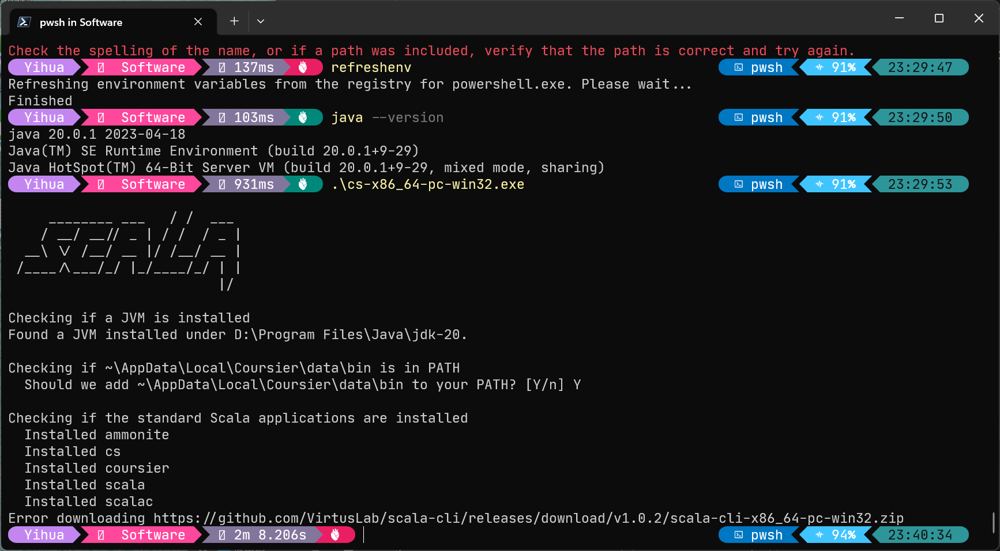
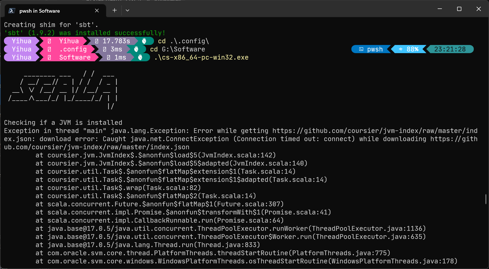
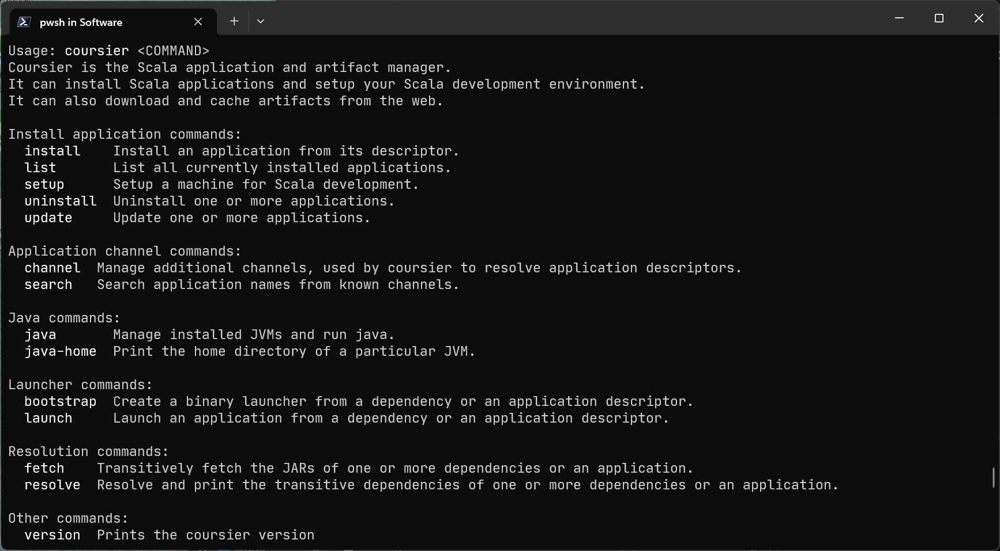
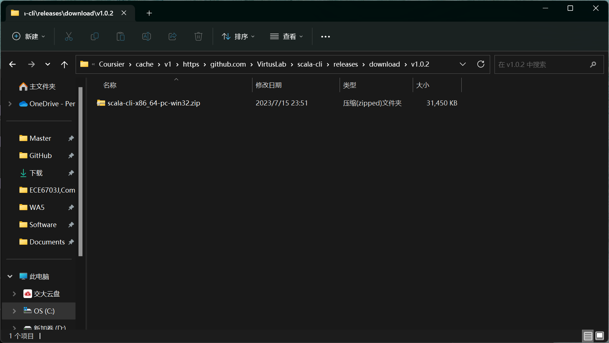
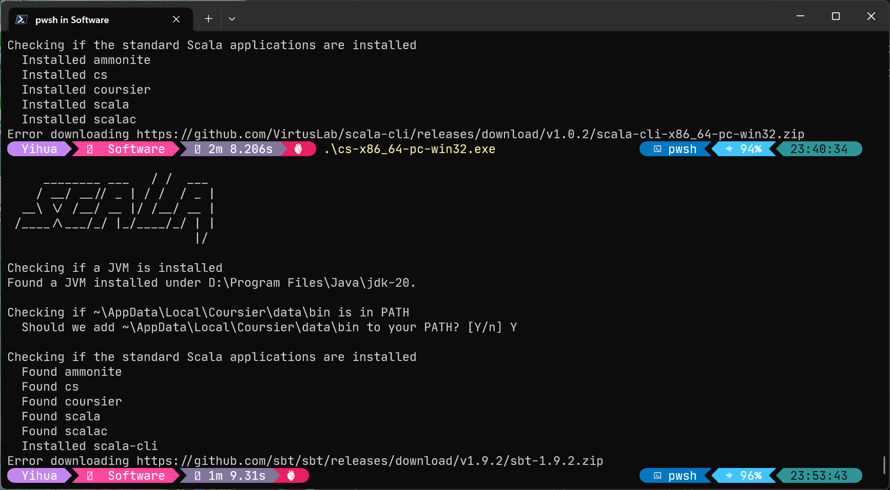
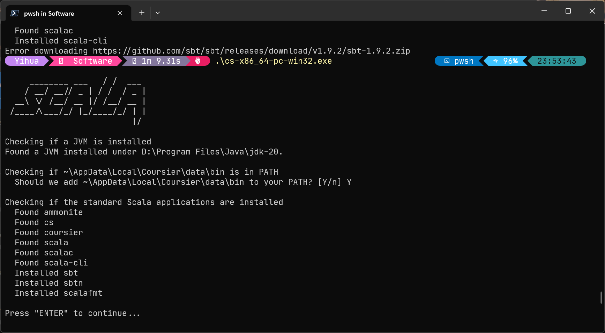
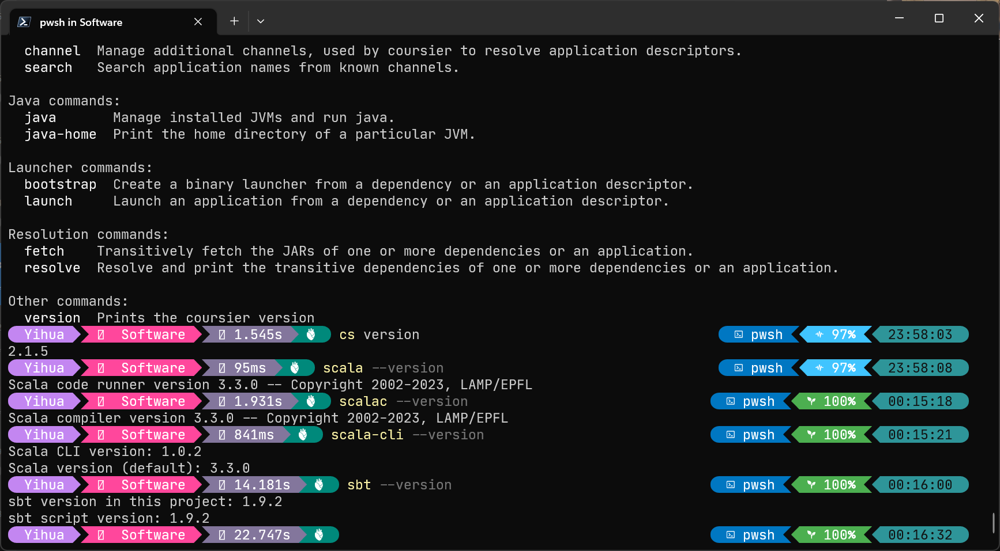

根据 Scala 官方目前的安装教程 https://docs.scala-lang.org/getting-started/index.html，我们下载 cs-x86_64-pc-win32.zip 并解压为 cs-x86_64-pc-win32.exe。在 PowerShell 中通过`java --version`确认 JVM 是否已安装，如果已安装，则切换到文件所在目录并运行
```powershell
.\cs-x86_64-pc-win32.exe
```

显示报错

> Error downloading https://github.com/VirtusLab/scala-cli/releases/download/v1.0.2/scala-cli-x86_64-pc-win32.zip

也可能显示如下报错：

在 PowerShell 中运行

```powershell
.\cs-x86_64-pc-win32.exe /?
```
显示帮助：

经查，在安装阶段，Coursier 并没有代理设置，因此我们需要在主机上设置好代理，手动将文件下载到本地并让安装程序黑盒自动识别。具体步骤如下：
首先将对应版本的 scala-cli（这里是 https://github.com/VirtusLab/scala-cli/releases/download/v1.0.2/scala-cli-x86_64-pc-win32.zip）下载到 C:\Users\<username>\AppData\Local\Coursier\cache\v1\https\github.com\VirtusLab\scala-cli\releases\download\v1.0.2，如图所示：

重新运行`.\cs-x86_64-pc-win32.exe`：

同样将对应版本的 sbt（这里是 https://github.com/sbt/sbt/releases/download/v1.9.2/sbt-1.9.2.zip）下载到 C:\Users\<username>\AppData\Local\Coursier\cache\v1\https\github.com\sbt\sbt\releases\download\v1.9.2。重新运行`.\cs-x86_64-pc-win32.exe`：

安装成功。检查版本：
