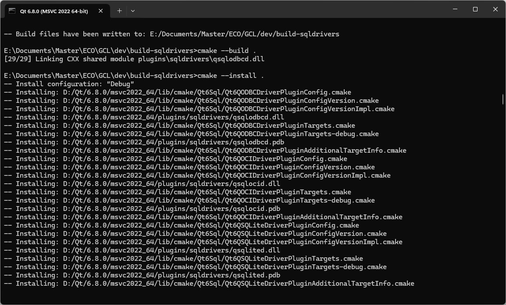

本文参考 [QOCI for the Oracle Call Interface (OCI)](https://doc.qt.io/qt-6/sql-driver.html#qoci-for-the-oracle-call-interface-oci)。
## Windows
1. 打开 Qt 6.8.0 (MSVC 2022 64-bit)。
>Setting up environment for Qt usage...
>Remember to call vcvarsall.bat to complete environment setup!
2. 执行
```cmd
"D:\Program Files\Microsoft Visual Studio\2022\Enterprise\VC\Auxiliary\Build\vcvars64.bat"
```
或
```cmd
"D:\Program Files\Microsoft Visual Studio\2022\Enterprise\VC\Auxiliary\Build\vcvarsall.bat" x64
```
或将该路径添加到环境变量 PATH。
3. 执行
```cmd
mkdir build-sqldrivers
cd build-sqldrivers
qt-cmake -G Ninja D:\Qt\6.8.0\Src\qtbase\src\plugins\sqldrivers -DCMAKE_INSTALL_PREFIX=D:\Qt\6.8.0\msvc2022_64 -DOracle_INCLUDE_DIR=D:\WINDOWS.X64_213000_db_home\oci\include -DOracle_LIBRARY=D:\WINDOWS.X64_213000_db_home\oci\lib\msvc\oci.lib -DCMAKE_BUILD_TYPE=RelWithDebInfo
cmake --build .
cmake --install .
```
其中，`qt-cmake`的位置在`D:\Qt\Qt 6.8.0\msvc2022_64\bin\qt-cmake.bat`，如果使用`cmake`则要注意检查所使用的`cmake`是否为该路径下的（如果环境变量 PATH 中有`cmake`则会使用 PATH 中的）。D:\Qt\6.8.0\msvc2022_64\plugins\sqldrivers 目录下初始只有 sqlite、mimer、odbc、psql（PostgreSQL）驱动。若未配置 Ninja，则在 cmake 指定 Generator 时也可指定 Visual Studio 17 2022，但存在 Bug，参考 [cl error D8016 when building oracle oci plugin for sql driver](https://bugreports.qt.io/browse/QTBUG-128670)、[Command line error D8016: '/O2' and '/RTC1' command-line options are incompatible](https://stackoverflow.com/questions/37007939/command-line-error-d8016-o2-and-rtc1-command-line-options-are-incompatibl)、[[CLion]Command line error D8016: '/O2' and '/RTC1' command-line options are incompatible](https://youtrack.jetbrains.com/issue/CPP-35594/CLionCommand-line-error-D8016-O2-and-RTC1-command-line-options-are-incompatible)。这个过程中会构建出qsqlite/qsqloci/qsqlodbc.dll/exp/lib/pdb，并将三个 DLL 和 PDB 文件安装到 D:\Qt\6.8.0\msvc2022_64\plugins\sqldrivers 目录下。其中，CMAKE_BUILD_TYPE 默认为 Release，在 Release 模式下只会构建 DLL、EXP、LIB 而不会构建 PDB（Program Debug Database）。
4. 如果需要 Debug 模式，则在上一步 cmake 时需要指定`-DCMAKE_BUILD_TYPE=Debug`。此时后续构建会构建出 qsqlited/qsqlocid/qsqlodbcd.dll/exp/ilk/lib/pdb，并将三个 DLL 和 PDB 文件安装到上述目录下。

6. 注意：在更新版本后，在使用 SQL Driver 的项目中，除了要重置缓存并重新加载项目以外，如果采用的不是 Qt Creator 而是 JetBrains CLion 等，则还要记得在 Qt 6.8.0 (MSVC 2022 64-bit) 中再次执行
```cmd
windeployqt --qmldir qml <YourApp>.exe
```
以免出现 Cannot mix incompatible Qt library 或找不到 DLL 等问题，参考[Cannot load QOCI SQL driver even successfully built
](https://forum.qt.io/topic/158713/cannot-load-qoci-sql-driver-even-successfully-built)。执行后在 build 目录下（对于 CLion 是形如 cmake-build-debug-visual-studio 的目录）的 sqldriver 目录下检查可以找到 qsqlocid.dll 等 DLL 文件，并且修改时间为最新，则部署成功。