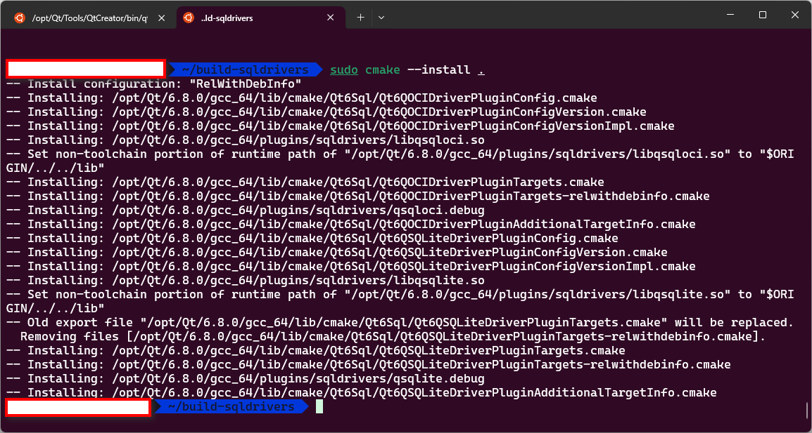

本文参考 [QOCI for the Oracle Call Interface (OCI)](https://doc.qt.io/qt-6/sql-driver.html#qoci-for-the-oracle-call-interface-oci)。
除一般的 Linux 系统外，本文也适用于 WSL 2。
在开始之前，如果没有安装 QOCI 插件，则试图链接 Oracle 数据库时会报错：
>Failed to create wl_display (No such file or directory)
>qt.qpa.plugin: Could not load the Qt platform plugin "wayland" in "" even though it was found.
>"QOCI driver not available."
>qt.sql.qsqldatabase: QSqlDatabase: QOCI driver not loaded
>qt.sql.qsqldatabase: QSqlDatabase: available drivers: QMIMER QPSQL QODBC QSQLITE QMARIADB QMYSQL
>QSqlError("", "Driver not loaded", "Driver not loaded")
1. 安装 CMake 等依赖。在 [Oracle Instant Client Downloads for Linux x86-64 (64-bit)
](https://www.oracle.com/database/technologies/instant-client/linux-x86-64-downloads.html)，以 ZIP 安装为例，下载 Base - one of these packages is required - Basic Package (ZIP)、Tools - optional packages - SQL*Plus Package (ZIP)、Development and Runtime - optional packages - SDK Package (ZIP)，展开网页内的Installation Instructions - Instant Client Installation for Linux x86-64 (64-bit) 教程操作，解压到`/opt/oracle`目录下（需要 sudo 权限）。其中，后两者均包含`META-INF`、`instantclient_23_5`两个目录，解压时合并目录，或使用`cp -r`命令合并目录。合并后目录结构如下：
>BASIC_LICENSE    legacy.so          libclntsh.so.23.1      libocci.so       libociei.so      sqlplus
>BASIC_README     libclntsh.so       libclntshcore.so       libocci.so.10.1  libocijdbc23.so  ucp.jar
>SDK_LICENSE      libclntsh.so.10.1  libclntshcore.so.12.1  libocci.so.11.1  libsqlplus.so    ucp11.jar
>SDK_README       libclntsh.so.11.1  libclntshcore.so.18.1  libocci.so.12.1  libsqlplusic.so  uidrvci
>SQLPLUS_LICENSE  libclntsh.so.12.1  libclntshcore.so.19.1  libocci.so.18.1  libtfojdbc1.so   xstreams.jar
>SQLPLUS_README   libclntsh.so.18.1  libclntshcore.so.20.1  libocci.so.19.1  network
>adrci            libclntsh.so.19.1  libclntshcore.so.21.1  libocci.so.20.1  ojdbc11.jar
>fips.so          libclntsh.so.20.1  libclntshcore.so.22.1  libocci.so.21.1  ojdbc8.jar
>genezi           libclntsh.so.21.1  libclntshcore.so.23.1  libocci.so.22.1  pkcs11.so
>glogin.sql       libclntsh.so.22.1  libnnz.so              libocci.so.23.1  sdk

保证目录内包含了`sqlplus`与`sdk`（sqlplus 可选，sdk 必需）。如果安装传统的 Oracle Client 21c 并使用 WSL，则需要 X11 依赖，如果采用的是 Qt Online Installer 安装的 Qt，则在安装程序阶段就已经安装过了相关依赖，故在此不作赘述。
2. 如果以上操作完成后`/opt/oracle/instantclient_23_5`目录内已包含链接`libclntsh.so`、`libocci.so`则不需依照教程重新链接（`ln -s`）一遍。将
```bash
export LD_LIBRARY_PATH=/opt/oracle/instantclient_19_3:$LD_LIBRARY_PATH
export PATH=/opt/oracle/instantclient_19_3:$PATH
```
添加到`.bash_profile`（如果用`zsh`可以直接添加到`.zshrc`）并`source`之。 
3. 执行
```bash
mkdir build-sqldrivers
cd build-sqldrivers
qt-cmake -G Ninja /opt/Qt/6.8.0/gcc_64/bin/qt-cmake -G Ninja /opt/Qt/6.8.0/Src/qtbase/src/plugins/sqldrivers -DCMAKE_INSTALL_PREFIX=/opt/Qt/6.8.0/gcc_64 -DOracle_ROOT=/opt/oracle/instantclient_23_5
cmake --build .
sudo cmake --install .
```
默认 CMake configuration 为“RelWithDebInfo”。
4. 重新 CMake、编译项目。如果存在其他问题，可执行
```bash
sudo chmod +x /opt/Qt/6.8.0/gcc_64/plugins/sqldrivers/libqsqlite.so
/opt/Qt/6.8.0/gcc_64/plugins/sqldrivers/libqsqloci.so
```
至此 QOCI 插件成功安装。
**注意：如果 Qt 版本小于 6.8.0，则第三步第三行命令应改为：**
```bash
/opt/Qt/6.8.0/gcc_64/bin/qt-cmake -G Ninja /opt/Qt/6.8.0/Src/qtbase/src/plugins/sqldrivers -DCMAKE_INSTALL_PREFIX=/opt/Qt/6.8.0/gcc_64 -DOracle_INCLUDE_DIR=/opt/oracle/instantclien
t_23_5/sdk/include -DOracle_LIBRARY=/opt/oracle/instantclient_23_5/libclntsh.so
```
其中`Oracle_INCLUDE_DIR`为存放`oci.h`等头文件的目录。