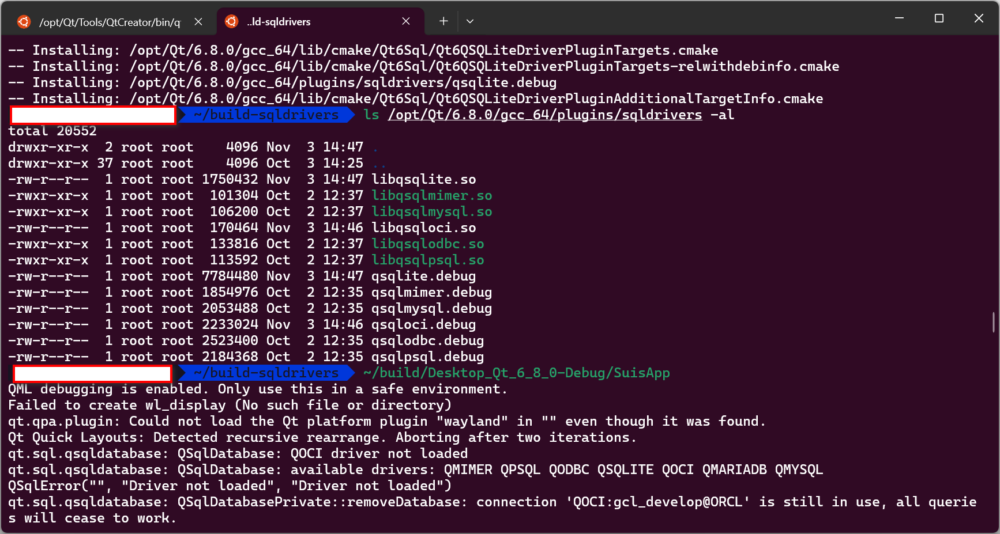

参考 [Linux Qt 6安装Oracle QOCI SQL Driver插件（适用WSL）](https://blog.csdn.net/yihuajack/article/details/143463914?spm=1001.2014.3001.5501) 安装 QOCI 插件完成后运行 Qt 项目报错：
>qt.sql.qsqldatabase: QSqlDatabase: QOCI driver not loaded
>qt.sql.qsqldatabase: QSqlDatabase: available drivers: QMIMER QPSQL QODBC QSQLITE QOCI QMARIADB QMYSQL
>QSqlError("", "Driver not loaded", "Driver not loaded")

可以看到尽管 QOCI 是 available driver 可用的驱动，但却未能加载成功。

对于 Windows 而言，可参考 [Cannot load QOCI SQL driver even successfully built](https://forum.qt.io/topic/158713/cannot-load-qoci-sql-driver-even-successfully-built)，重新在构建目录下运行`windeployqt --qmldir qml YourApp.exe`即可，这是因为在 Windows 构建中，构建系统会将 SQL 驱动复制到构建目录下以便 Qt 程序直接使用，因此在 Windows 中出现该情况需要第一时间找到构建目录下的`sqldrivers`目录是否已被更新。
对于 Linux 而言，这一问题通常是 Oracle 数据库本身的问题。在 Sehll 中运行`sqlplus`报错：

>sqlplus: error while loading shared libraries: libaio.so.1: cannot open shared object file: No such file or directory

可以看到 sqlplus找不到`libaio.so.1`，然而执行
```bash
sudo apt install libaio1t64 libaio-dev 
```
显示这两个包都已安装（旧版 Ubuntu 系统相应的包名是`libaio1`）。参考 [Ubuntu 24.04 PHP 8.3 OCI8 and libaio.so.1](https://askubuntu.com/questions/1511776/ubuntu-24-04-php-8-3-oci8-and-libaio-so-1)，执行`ldconfig -p | grep libaio`显示：
>libaio.so.1t64 (libc6,x86-64) => /lib/x86_64-linux-gnu/libaio.so.1t64
>libaio.so (libc6,x86-64) => /lib/x86_64-linux-gnu/libaio.so

并且在`/lib/x86_64-linux-gnu`与`/usr/lib/x86_64-linux-gnu`目录中同样只能找到`libaio.so`和`libaio.so.1t64`。执行
```bash
sudo ln -s /usr/lib/x86_64-linux-gnu/libaio.so.1t64 /usr/lib/x86_64-linux-gnu/libaio.so.1
```
重新运行使用了 Qt SQL 驱动的 Qt 程序，运行成功。